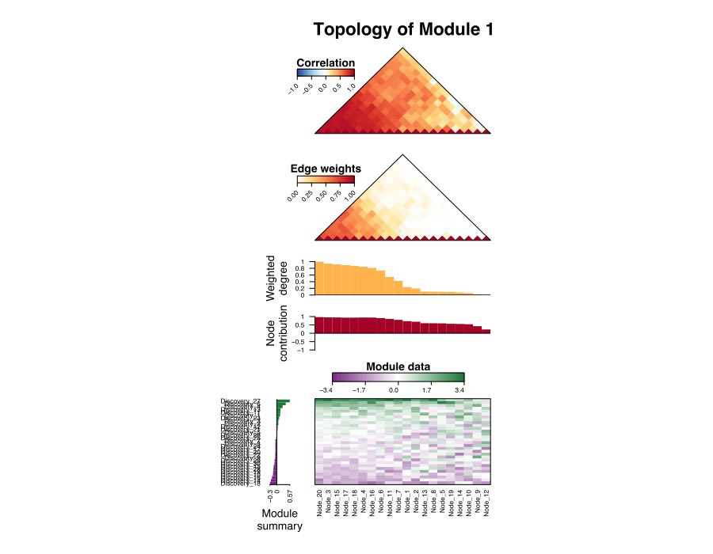
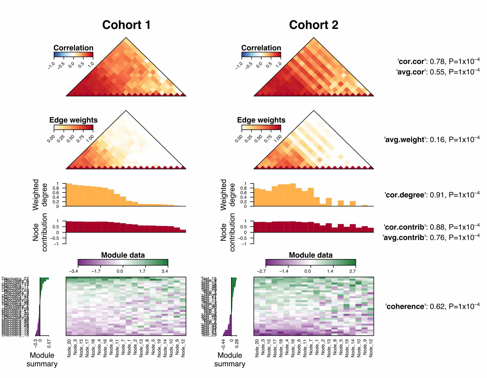

```{r, echo=FALSE, cache=FALSE}
options(width = 100)
```

## Introduction

The **NetRep** package provides functions for assessing the preservation of network
modules across datasets.
  
This type of analysis is suitable where networks can be meaningfully inferred
from multiple datasets. These include gene coexpression networks,
protein-protein interaction networks, and microbial co-occurence networks.
Modules within these networks consist of groups of nodes that are particularly
interesting: for example a group of tightly connected genes associated with a
disease, groups of genes annotated with the same term in the Gene Ontology
database, or groups of interacting microbial species, *i.e.* communities.

Application of this method can answer questions such as:

1. Do the relationships between genes in a module replicate in an independent 
   cohort? 
2. Are these gene coexpression modules preserved across tissues or are they 
   tissue specific?
3. Are these modules conserved across species? 
4. Are microbial communities preseved across multiple spatial locations?

A typical workflow for a **NetRep** analysis will usually contain the following 
steps, usually as separate scripts.

1. Calculate the correlation structure and network edges in each dataset 
   using some network inference algorithm.
2. Load these matrices into R and set up the input lists for **NetRep**'s 
   functions.
3. Run the permutation test procedure to determine which modules are 
   preserved in your test dataset(s).
4. Visualise your modules of interest.
5. Calculate the network properties in your modules of interest
   for downstream analyses. 

## System requirements and installation troubleshooting

**NetRep** and its dependencies require several third party libraries to be
installed. If not found, installation of the package will fail.

**NetRep** requires:

 1. A compiler with `C++11` support for the `<thread>` libary.
 2. A `fortran` compiler.
 3. `BLAS` and `LAPACK` libraries.
 
The following sections provide operating system specific advice for getting
**NetRep** working if installation through R fails.
 
### OSX

The necessary `fortran` and `C++11` compilers are provided with the `Xcode` 
application and subsequent installation of `Command line tools`. The most
recent version of OSX should prompt you to install these tools when 
installing the `devtools` package from RStudio. Those with older versions of 
OSX should be able to install these tools by typing the following command into 
their Terminal application: `xcode-select --install`.

Some users on OSX Mavericks have reported that even after this step they 
receive errors relating to `-lgfortran` or `-lquadmath`. This is reportedly 
solved by installing the version of `gfortran` used to compile the R binary for
OSX: `gfortran-4.8.2`. This can be done using the following commands in your 
`Terminal` application: 

```{r, engine="bash", eval=FALSE}
curl -O http://r.research.att.com/libs/gfortran-4.8.2-darwin13.tar.bz2
sudo tar fvxz gfortran-4.8.2-darwin13.tar.bz2 -C /
```

### Windows

For Windows users **NetRep** requires R version 3.3.0 or later. The 
necessary `fortran` and `C++11` compilers are provided with the `Rtools` 
program. We recommend installation of `NetRep` through `RStudio`, which should
prompt the user and install these tools when running 
`devtools::install_github("InouyeLab/NetRep")`. You may need to run this 
command again after `Rtools` finishes installing.

### Linux

If installation fails when compiling **NetRep** at `permutations.cpp` with an 
error about `namespace thread`, you will need to install a newer version of 
your compiler that supports this `C++11` feature. We have found that this works
on versions of `gcc` as old as `gcc-4.6.3`.

If installation fails prior to this step it is likely that you will need to 
install the necessary compilers and libraries, then reinstall R. For `C++` and 
`fortran` compilers we recommend installing `g++` and `gfortran` from the
appropriate package manager for your operating system (e.g. `apt-get` for 
Ubuntu). `BLAS` and `LAPACK` libraries can be installed by installing 
`libblas-dev` and `liblapack-dev`. Note that these libraries **must** be
installed prior to installation of R.

## Data required for a NetRep analysis

Any **NetRep** analysis requires the following data to be provided and 
pre-computed for each dataset:

 - An adjacency matrix whose entries indicate the strength of the relationship 
   between nodes.
 - A matrix whose entries contain the correlation coefficient between each pair
   of nodes in the network.
 - a vector containing the module/group label for each node in the network
   for each discovery dataset.
 - Optionally, a "data matrix", which contains the data used to calculate the 
   correlation structure and infer the network, *e.g.* gene expression data.

There are many different approaches to network inference and module detection.
For gene expression data, we recommend using Weighted Gene Coexpression Network
Analysis through the [WGCNA][1] package. For microbial abundance data we 
recommend the Python program [SparCC][2]. Microbial communities (modules) can
then be defined as any group of significantly co-occuring microbes.

[1]: https://cran.r-project.org/package=WGCNA
[2]: http://dx.doi.org/10.1371/journal.pcbi.1002687

### Tutorial data

For this vignette, we will use gene expression data simulated for two 
independent cohorts. The *discovery* dataset was simulated to contain four 
modules of varying size, two of which (Modules 1 and 4) replicate in the *test* 
dataset. 

Details of the simulation are provided in the documentation for the 
package data (see `help("NetRep-data")`).

This data is provided with the **NetRep** package: 

```{r}
library("NetRep")
data("NetRep")
```

This command loads seven objects into the R session:

  - `discovery_data`: a matrix with 150 columns (genes) and 30 rows (samples) 
     whose entries correspond to the expression level of each gene in each 
     sample in the discovery dataset.
  - `discovery_correlation`: a matrix with 150 columns and 150 rows containing 
     the correlation-coefficients between each pair of genes calculated from the 
    `discovery_data` matrix.
  - `discovery_network`: a matrix with 150 columns and 150 rows containing the 
     network edge weights encoding the interaction strength between each pair of 
     genes in the discovery dataset.
  - `module_labels`: a named vector with 150 entries containing the module 
     assignment for each gene as identified in the discovery dataset. Here, 
     we've given genes that are not part of any module/group the label "0".
  - `test_data`: a matrix with 150 columns (genes) and 30 rows (samples) whose 
     entries correspond to the expression level of each gene in each sample in 
     the test dataset.
  - `test_correlation`: a matrix with 150 columns and 150 rows containing the 
     correlation-coefficients between each pair of genes calculated from the 
    `test_data` matrix.
  - `test_network`: a matrix with 150 columns and 150 rows containing the 
     network edge weights encoding the interaction strength between each pair of
     genes in the test dataset.
     
### Setting up the input lists

Next, we will combine these objects into list structures. All functions 
in the **NetRep** package take the following arguments:

 - `network`: a list of interaction networks, one for each dataset.
 - `data`: a list of data matrices used to infer those networks, one for each 
    dataset.
 - `correlation`: a list of matrices containing the pairwise correlation 
    coefficients between variables/nodes in each dataset.
 - `moduleAssignments`: a list of vectors, one for each *discovery* dataset, 
    containing the module assignments for each node in that dataset.
 - `modules`: a list of vectors, one vector for each *discovery* dataset, 
    containing the names of the modules from that dataset to run the function 
    on.
 - `discovery`: a vector indicating the names or indices to use as the 
   *discovery* datasets in the `network`, `data`, `correlation`, 
   `moduleAssignments`, and `modules` arguments.
 - `test`: a list of vectors, one vector for each *discovery* dataset, 
    containing the names or indices of the `network`, `data`, and `correlation` 
    argument lists to use as the *test* dataset(s) for the analysis of each 
   *discovery* dataset.
   
Each of these lists may contain any number of datasets. The names provided to
each list are used by the `discovery` and `test` arguments to determine which
datasets to compare. More than one  dataset can be specified in each of these 
arguments, for example when performing a pairwise analysis of gene coexpression
modules identified in multiple tissues.

Typically we would put the code that reads in our data and sets up the input
lists in its own script. This loading script can then be called from our 
scripts where we calculate the module preservation, visualise our networks, 
and calculate the network properties:

```{r}
# Read in the data:
data("NetRep")

# Set up the input data structures for NetRep. We will call these datasets 
# "cohort1" and "cohort2" to avoid confusion with the "discovery" and "test"
# arguments in NetRep's functions:
data_list <- list(cohort1=discovery_data, cohort2=test_data)
correlation_list <- list(cohort1=discovery_correlation, cohort2=test_correlation)
network_list <- list(cohort1=discovery_network, cohort2=test_network)

# We do not need to set up a list for the 'moduleAssignments', 'modules', or 
# 'test' arguments because there is only one "discovery" dataset.
```

We will call these "cohort1" and "cohort2" to avoid confusion with the 
arguments "discovery" and "test" common to **NetRep**'s functions.

## Running the permutation procedure to test module preservation

Now we will use **NetRep** to permutation test whether the network topology of 
each module is preserved in our test dataset using the `modulePreservation` 
function. This function calculates seven module preservation statistics for 
each module (more on these later), then performs a permutation procedure in 
the test dataset to determine whether these statistics are significant. 

We will run 10,000 permutations, and split calculation across 2 threads so that
calculations are run in parallel. By default, `modulePreservaton` will test the
preservation of all modules, excluding the network background which is assumed
to have the label "0". This of course can be changed: there are many more 
arguments than shown here which control how `modulePreservation` runs. See
`help("modulePreservation")` for a full list of arguments.

```{r}
# Assess the preservation of modules in the test dataset.
preservation <- modulePreservation(
 network=network_list, data=data_list, correlation=correlation_list, 
 moduleAssignments=module_labels, discovery="cohort1", test="cohort2", 
 nPerm=10000, nThreads=2
)
```

The results returned by `modulePreservation` for each dataset comparison are a 
list containing seven elements:

 - `nulls` the null distribution for each statistic and module generated by the
    permutation procedure.
 - `observed` the observed value of each module preservation statistic for each
   module.
 - `p.values` the p-values for each module preservation statistic for each 
   module.
 - `nVarsPresent` the number of variables in the *discovery* dataset that had 
   corresponding measurements in the *test* dataset.
 - `propVarsPresent` the proportion of nodes in each module that had 
   corresponding measurements in the *test* dataset.
 - `totalSize` the total number of nodes in the *discovery* network.
 - `alternative` the alternate hypothesis used in the test (e.g. "the module 
   preservation statistics are higher than expected by chance").

If the *test* dataset has also had module discovery performed in it, a 
contigency table tabulating the overlap in module content between the two 
datasets is returned.

Let's take a look at our results:

```{r}
preservation$observed
preservation$p.value
```

For now, we will consider all statistics equally important, so we will consider
a module to be preserved in "cohort2" if all the statistics have a permutation
test P-value < 0.01:

```{r}
# Get the maximum permutation test p-value
max_pval <- apply(preservation$p.value, 1, max)
max_pval
```

Only modules 1 and 4 are reproducible at this significance threshold.

## The module preservation statistics

So what do these statistics measure? Let's take a look at the network topology
of Module 1 in the discovery dataset, "cohort1":



From top to bottom, the plot shows:

 - A heatmap of the correlation coefficients between nodes in the module.
 - A heatmap of the network edge weights between nodes in the module.
 - The scaled weighted degree for each node: this is the sum of each node's 
   connections to all other nodes in the module, normalised to the most 
   connected node. This is a relative measure of how connected each node is 
   within the module.
 - The contribution of each node to the module: this is the correlation between
   each node and the module's summary profile.
 - A heatmap of the measurements of each node in the module across samples in 
   the dataset (y-axis)
 - To the left, the module's summary profile: a set of observations that best
   summarise the measurements across all nodes for each sample. This is 
   calculated as the first eigenvector of a principal component analysis: 
   *i.e.* the linear combination of nodes that explains the greatest portion of
   the variance in the module's data.
   
Now, let's take a look at the topology of Module 1 in the discovery and the 
test datasets side by side along with the module preservation statistics:



There are seven module preservation statistics:

 1. **'cor.cor'** measures the *concordance of the correlation structure*: or, 
    how similar the correlation heatmaps are between the two datasets.
 2. **'avg.cor'** measures the *average magnitude of the correlation coefficients*
    of the module in the test dataset: or, how tightly correlated the module 
    is on average in the test dataset. This score is penalised where the 
    correlation coefficients change in sign between the two datasets.
 3. **'avg.weight'** measures the *average magnitude of edge weights* in the 
    test dataset: or how connected nodes in the module are to each other on 
    average.
 4. **'cor.degree'** measures the *concordance of the weighted degree* of 
    nodes between the two datasets: or, whether the nodes that are most 
    strongly connected in the discovery dataset remain the most strongly 
    connected in the test dataset.
 5. **'cor.contrib'** measures the *concordance of the node contribution* between
    the two datasets: this measures whether the module's summary profile 
    summarises the data in the same way in both datasets.
 6. **'avg.contrib'** measures the *average magnitude of the node contribution* 
    in the test dataset: this is a measure of how coherent the data is in the 
    test dataset. This score is penalised where the node contribution changes in 
    sign between the two datasets: for example, where a gene is differentially
    expressed between the two datasets.
 7. **'coherence'** measures the proportion of variance in the module data 
    explained by the module's summary profile vector in the test dataset.
    
A permutation procedure is necessary to determine whether the value of each
statistic is significant: *e.g.* whether they are higher than expected by 
chance, *i.e.* when measuring the statistics between the module in the 
discovery dataset, and random sets of nodes in the test dataset. 

By default, the permutation procedure will sample from only nodes that are
present in both datasets. This is appropriate where the assumption is that any
nodes that are present in the test dataset but not the discovery dataset are 
unobserved in the discovery dataset: *i.e.* they may very well fall in one of 
your modules of interest. This is appropriate for microarray data. Alternatively,
you may set `null="all"`, in which case the permutation procedure will sample
from all variables in the test dataset. This is appropriate where the variable
can be assumed not present in the discovery dataset: for example microbial 
abundance or RNA-seq data.

You can also test whether these statistics are smaller than expected by chance
by changing the alternative hypothesis in the `modulePreservation` function 
(e.g. `alternative="lower"`).

### Choosing the right statistics

The module preservation statistics that **NetRep** calculates were designed
for weighted gene coexpression networks. These are *complete* networks: every
gene is connected to every other gene with an edge weight of varying strength.
Modules within these networks are groups of genes that are tightly connected or 
coexpressed. 

For other types of networks, some statistics may be more suitable than others 
when assessing module preservation. Here, we provide some guidelines and 
pitfalls to be aware of when interpreting the network properties and module 
preservation statistics in other types of networks.

#### Sparse networks

Sparse networks are networks where many edges have a "0" value: that is, 
networks where many nodes have no connection to each other. Typically these are
networks where edges are defined as present if the relationship between nodes
passes some pre-defined cut-off value, for example where genes are 
significantly correlated, or where the correlation between microbe presence and
absence is significant. In these networks, edges may simply indicate presence
or absence, or they may also carry a weight indicating the strength of the 
relationship. 

For networks with unweighted edges, the *average edge weight* 
(**'avg.weight'**) measures the proportion of nodes that are connected to each
other. The *weighted degree* simply becomes the node *degree*: the number of 
connections each node has to any other node in the module.

If the network is sparse the permutation tests for the 
*correlation of weighted degree* may be underpowered. Entries in the null 
distribution will be `NA` where there were no edges between any nodes in the 
permuted module. This is because the *weighted degree* will
be 0 for all nodes, and the correlation coefficient cannot be calculated 
between two vectors if all entries are the same in either vector. This reduces
the effective number of permutations for that test: the permutation P-values
will be calculated ignoring the `NA` entries, and the `modulePreservation` 
function will generate a warning. 

You may wish to consider `NA` entries where there were no edges as 0 when 
calculating the permutation test P-values. Note that an `NA` entry does not 
necessarily mean that all edges in the permuted module were 0: it can also mean 
that all edges are present and have identical weights. To distinguish between
these cases you should check whether the `avg.weight` is also 0.

The following code snippet shows how to identify these entries in the null 
distribution, replace them with zeros, and recalculate the permutation test
P-values:

```{r, eval=FALSE}
# Handling NA entries in the 'cor.degree' null distribution for sparse networks

# Get the entries in the null distribution where there were no edges in the 
# permuted module
na.entries <- which(is.na(preservation$nulls[,'cor.degree',]))
no.edges <- which(preservation$nulls[,'avg.weight',][na.entries] == 0)

# Set those entries to 0
preservation$nulls[,'cor.degree',][no.edges] <- 0

# Recalculate the permutation test p-values
preservation$p.values <- permutationTest(
  preservation$nulls, preservation$observed, preservation$nVarsPresent,
  preservation$totalSize, preservation$alternative
)
```

#### Directed networks

For networks where the edges are directed, the user should be aware that the 
*weighted degree* is calculated as the column sum of the module within the
supplied `network` matrix. This usually means that the result will be the 
*in*-degree: the number and combined weight of edges ending in each node. To
calculate the *out*-degree you will need to transpose the matrix supplied
to the `network` argument (*i.e.* using the `t()` function).

Note that directed networks are typically sparse, and have the same pitfalls 
as sparse networks described above.

#### Sparse data

Sparse data is data where many entries are zero. Examples include microbial 
abundance data: where most microbes are present in only a few samples. 

Users should be aware that  the *average node contribution* (**'avg.contrib'**), 
*concordance of node contribution* (**'cor.contrib'**), and the 
*module coherence* (**'coherence'**) will be systematically underestimated.
They are all calculated from the *node contribution*,  which measures the 
Pearson correlation coefficient between each node and the *module summary*. 
Pearson correlation coefficinets are inappropriate when data is sparse: their
value will be underestimated when calculated between two vectors where 
many observations in either vector are equal to 0. However, this should not 
affect the permutation test P-values since observations in their null 
distributions will be similarly underestimated.

The biggest problem with sparse data is how to handle variables where all 
observations are zero in either dataset. These will result in `NA` values for 
their *node contribution* to a module (or permuted module). These will be 
ignored by the *average node contribution* (**'avg.contrib'**),
*concordance of node contribution* (**'cor.contrib'**), and *module coherence* 
(**'coherence'**) statistics: which only take complete cases. This is 
problematic if many nodes have `NA` values, since observations in their null 
distributions will be for permuted modules of different sizes. 

Their are two approaches to dealing with this issue: 

1. Filtering both datasets to contain only variables which are present in both 
   datasets. For examples, microbes that are abundant in at least one sample 
   in both datasets. 
2. Setting observations that are zero to a very small randomly generated 
   number. The goal is for *node contribution* values to be close to 0 where
   they would otherwise be set to `NA`. For microbial abundance data we 
   recommend generating numbers between 0 and 1/the number of 
   samples: the noise values should be small enough that the do not change the
   *node contribution* for microbes which are present in one or more samples.
   
For the latter, code to generate noise would look something like:

```{r, eval=FALSE}
not.present <- which(discovery_data == 0)
nSamples <- nrow(discovery_data)
discovery_data[not.present] <- runif(length(not.present), min=0, max=1/nSamples)
```

#### Proportional data

Proportional data is data where the sum of measurements across each sample is 
equal to 1. Examples of this include RNA-seq data and microbial abundance read
data.

Users should be aware that the *average node contribution* (**'avg.controb'**), 
*concordance of node contribution* (**'cor.contrib'**), and the 
*module coherence* (**'coherence'**) will be systematically overestimated.
They are all calculated from the *node contribution*, which measures the 
Pearson correlation coefficient between each node and the *module summary*. 
Pearson correlation coefficients are overestimated when calculated on 
proportional data. This should not affect the permutation test P-values since
the null distribution observations will be similarly overestimated. 

Users should also be aware of this when calculating the correlation structure 
between all nodes for the `correlation` matrix input, and use an appropriate
method for calculating these relationships.

#### Homogenous modules

Homogenous modules are modules where all nodes are similarly correlated or 
similarly connected: differences in edge weights, correlation coefficients,
and node contributions are due to noise. 

For these modules, the *concordance of correlation* (**'cor.cor'**), 
*concordance of node contribution* (**'cor.contrib'**), and
*correlation of weighted degree* (**'cor.degree'**) may be small, with large
permutation test P-values, even where a module is preserved, due to irrelevant
changes in node rank for each property between the discovery and test datasets.

These statistics should be considered in the context of their "average" 
counterparts: the *average correlation coefficient* (**'avg.cor'**), 
*average node contribution* (**'avg.contrib'**) and *average edge weight* 
(**'avg.weight'**). If these are high, with significant permutation test 
P-values, and the *module coherence* is high, then the module should be 
investigated further. 

Module homogeneity can be investigated through plotting their network topology 
in both datasets (see next section). In our experience, the smaller the module, 
the more likely it is to be topologically homogenous.

#### Small network modules

The module preservation statistics break down for modules with less than four
nodes. The number of nodes is effectively the sample size when calculating the
value of a module preservation statistic. If you wish to use **NetRep** to 
analyse these modules, you should use only the *average edge weight* 
(**'avg.weight'**), *module coherence* (**'coherence'**), 
*average node contribution* (**'avg.contrib'**), and 
*average correlation coefficient* (**'avg.cor'**) statistics.

## Visualising network modules

We can visualise the network topology of our modules using the `plotModule`
function. It takes the same input data as the `modulePreservation` function: 
 
  - `network`: a list of network adjacency matrices, one for each dataset.
  - `correlation`: a list of matrices containing the correlation coefficients
     between nodes.
  - `data`: a list of data matrices used to infer the `network` and 
    `correlation` matrices.
  - `moduleAssignments`: a list of vectors, one for each *discovery* dataset,
     containing the module labels for each node.
  - `modules`: the modules we want to plot.
  - `discovery`: the dataset the modules were identified in.
  - `test`: the dataset we want to plot the modules in.

First, let's look at the four modules in the *discovery* dataset:

```{r modules_in_discovery, dev="jpeg", dev.args=list(quality=50),  dpi=72, fig.height=7, fig.width=7, fig.align="center", results="hold", fig.keep="last", fig.show="hold"}
plotModule(
  data=data_list, correlation=correlation_list, network=network_list, 
  moduleAssignments=module_labels, modules=c(1,2,3,4),
  discovery="cohort1", test="cohort1"
)
```

By default, nodes are ordered from left to right in decreasing order of 
*weighted degree*: the sum of edge weights within each module, *i.e.* how strongly
connected each node is within its module. For visualisation, the *weighted degree* 
is normalised within each module by the maximum value since the *weighted degree* 
of nodes can be dramatically different for modules of different sizes.

Samples are ordered from top to bottom in descending order of the module summary
profile of the left-most shown module.

When we plot the four modules in the test dataset, the nodes remain in the same
order: that is, in decreasing order of *weighted degree* in the *discovery* 
dataset. This allows you to directly compare topology plots in each dataset of 
interest:

```{r modules_in_test, dev="jpeg", dev.args=list(quality=50),  dpi=72, fig.height=7, fig.width=7, fig.align="center", results="hold", fig.keep="last", fig.show="hold"}
plotModule(
  data=data_list, correlation=correlation_list, network=network_list, 
  moduleAssignments=module_labels, modules=c(1,2,3,4),
  discovery="cohort1", test="cohort2"
)
```

Here we can clearly see from the correlation structure and network edge weight
heatmaps that Modules 1 and 4 replicate.

By default, samples in this new plot are orderded in descending order of the 
left most module's summary profile, as calculated in the `test` dataset. If 
we're analysing module preservation across datasets drawn from the same samples,
e.g. different tissues, we can change the plot so that samples are ordered as
per the `discovery` dataset by setting `orderSamplesBy = "cohort1"`. We won't
do this here, since our two datasets have different samples.

We can change the order of nodes on the plot by setting `orderNodesBy`. If we
want to order nodes instead by our *test* dataset, we can set 
`orderNodesBy = "cohort2"`. However, a more informative setting is to tell 
`plotModule` to order the nodes by the average *weighted degree* across our
datasets. For preserved modules, this provides a more robust estimate of
the *weighted degree* and a more robust ordering of nodes by relative importance
to their module, so we will plot just Modules 1 and 4. 

```{r mean_degree, dev="jpeg", dev.args=list(quality=50),  dpi=72, fig.height=7, fig.width=7, fig.align="center", results="hold", fig.keep="last", fig.show="hold"}
plotModule(
  data=data_list, correlation=correlation_list, network=network_list, 
  moduleAssignments=module_labels, modules=c(1,4), # only the preserved modules
  discovery="cohort1", test="cohort2",
  orderNodesBy=c("cohort1", "cohort2") # this can be any number of datasets
)
```

### Tweaking the plot appearance

When drawing these plots yourself, you may need to tweak the appearance and
placement of the axis labels and legends, which may change depending on the
size of the device you are drawing the plot on. There is an extensive set of 
options for modifying the size and placement of the axes, legends, and their
individual elements. A list and description of these can be found in the 
"plot layout and device size" section of the help file for `plotModule`.

When tweaking these parameters, you should set the `dryRun` argument to `TRUE`.
When `dryRun = TRUE`, only the axes and labels will be drawn, avoiding the
drawing time for the heatmaps, which may take some time for large modules. 

Let's tweak the previous plot:

```{r dry_run, dev="jpeg", dev.args=list(quality=50),  dpi=72, fig.height=7, fig.width=7, fig.align="center", results="hold", fig.keep="last", fig.show="hold"}
plotModule(
  data=data_list, correlation=correlation_list, network=network_list, 
  moduleAssignments=module_labels, modules=c(1,4),
  discovery="cohort1", test="cohort2",
  orderNodesBy=c("cohort1", "cohort2"),
  dryRun=TRUE
)
```

Now we can quickly iterate over parameters until we're happy with the plot:

```{r dry_run_customised, dev="jpeg", dev.args=list(quality=50),  dpi=72, fig.height=7, fig.width=7, fig.align="center", results="hold", fig.keep="last", fig.show="hold"}
# Change the margins so the plot is more compressed. Alternatively we could 
# change the device window.
par(mar=c(3,10,3,10)) # bottom, left, top, right margin sizes
plotModule(
  data=data_list, correlation=correlation_list, network=network_list, 
  moduleAssignments=module_labels, modules=c(1,4),
  discovery="cohort1", test="cohort2",
  orderNodesBy=c("cohort1", "cohort2"),
  dryRun=TRUE, 
  # Title of the plot
  main = "Preserved modules", 
  # Use the maximum edge weight as the highest value instead of 1 in the
  # network heatmap
  netRange=NA,
  # Turn off the node and sample labels:
  plotNodeNames=FALSE, plotSampleNames=FALSE,
  # The distance from the bottom axis should the module labels be drawn:
  maxt.line=0,
  # The distance from the legend the legend titles should be drawn:
  legend.main.line=2
)
```

Once we're happy, we can turn off the `dryRun` parameter:

```{r mean_degree_customised, dev="jpeg", dev.args=list(quality=50),  dpi=72, fig.height=7, fig.width=7, fig.align="center", results="hold", fig.keep="last", fig.show="hold"}
par(mar=c(3,10,3,10)) 
plotModule(
  data=data_list, correlation=correlation_list, network=network_list, 
  moduleAssignments=module_labels, modules=c(1,4),
  discovery="cohort1", test="cohort2",
  orderNodesBy=c("cohort1", "cohort2"), main = "Preserved modules", 
  netRange=NA, plotNodeNames=FALSE, plotSampleNames=FALSE,
  maxt.line=0, legend.main.line=2
)
```

### Plotting the individual components 

We can also plot individual components of the plot separately. For example, 
a heatmap of the correlation structure:

```{r correlation_heatmap, dev="jpeg", dev.args=list(quality=50),  dpi=72, fig.height=7, fig.width=7, fig.align="center", results="hold", fig.keep="last", fig.show="hold"}
par(mar=c(5,5,4,4)) 
plotCorrelation(
  data=data_list, correlation=correlation_list, network=network_list, 
  moduleAssignments=module_labels, modules=0:4, discovery="cohort1",
  test="cohort1", symmetric=TRUE, orderModules=FALSE
)
```

A full list of function and arguments for these individual plots can be found
at `help("plotTopology")`.

## Calculating the network properties of a module

Finally, we can calculate the topological properties of the network modules for
use in other downstream analyses. Possible downstream analyses include:

 - Assessing the association between a module and a phenotype of interest 
   using the module summary profile.
 - Ranking nodes by relative importance using the weighted node degree
 
To do this, we use the `networkProperties` function, which has the same 
arguments as the `modulePreservation` function. We will calculate the network 
properties of modules 1 and 4, which were preserved in "cohort2", in both 
datasets:

```{r}
properties <- networkProperties(
  data=data_list, correlation=correlation_list, network=network_list, 
  moduleAssignments=module_labels, 
  # Only calculate for the reproducible modules
  modules=c(1,4),
  # what dataset were the modules identified in?
  discovery="cohort1", 
  # which datasets do we want to calculate their properties in?
  test=c("cohort1", "cohort2")
)

# The summary profile of module 1 in the discovery dataset:
properties[["cohort1"]][["1"]][["summary"]]
# Along with the proportion of variance in the module data explained by the 
# summary profile:
properties[["cohort1"]][["1"]][["coherence"]]

# The same information in the test dataset:
properties[["cohort2"]][["1"]][["summary"]]
properties[["cohort2"]][["1"]][["coherence"]]
```

## Managing memory with large datasets

```{r, echo=FALSE, message=FALSE, results="hide"}
# This is the code necessary for the later part of this section to run.
# The vignette doesnt actually save the data.
discovery_data <- as.disk.matrix(discovery_data, tempfile())
discovery_correlation <- as.disk.matrix(discovery_correlation, tempfile())
discovery_network <- as.disk.matrix(discovery_network, tempfile())
test_data <- as.disk.matrix(test_data, tempfile())
test_correlation <- as.disk.matrix(test_correlation, tempfile())
test_network <- as.disk.matrix(test_network, tempfile())
```

When analysing large datasets, *e.g.* transcriptome-wide gene coexpression 
networks, it may not be possible to fit all matrices for both datasets in
memory. **NetRep** provides an additional class, `disk.matrix`, which stores a 
filepath to a matrix on disk, along with meta-data on how to read that file. 
This allows **NetRep**'s functions to load matrices into RAM only when 
required, so that only one dataset is kept in memory at any point in time.

The `disk.matrix` class recognises two types of files: matrix data saved in 
table format (i.e. a file that is normally read in by `read.table` or 
`read.csv`), and serialized R objects saved through `saveRDS`. Serialized R 
objects are much faster to load into R than files in table format, but cannot 
be read by other programs. We recommend storing your files in both formats 
unless you are low on disk space.

First, we need to make sure our matrices are saved to disk. Matrices can be
converted to `disk.matrix` objects directly through the `as.disk.matrix` 
function:

```{r, eval=FALSE}
# serialize=TRUE will save the data using 'saveRDS'. 
# serialize=FALSE will save the data as a tab-separated file ('sep="\t"').
discovery_data <- as.disk.matrix(
  x=discovery_data, 
  file="discovery_data.rds", 
  serialize=TRUE)
discovery_correlation <- as.disk.matrix(
  x=discovery_correlation, 
  file="discovery_correlation.rds", 
  serialize=TRUE)
discovery_network <- as.disk.matrix(
  x=discovery_network, 
  file="discovery_network.rds",
  serialize=TRUE)
test_data <- as.disk.matrix(
  x=test_data, 
  file="test_data.rds", 
  serialize=TRUE)
test_correlation <- as.disk.matrix(
  x=test_correlation, 
  file="test_correlation.rds", 
  serialize=TRUE)
test_network <- as.disk.matrix(
  x=test_network, 
  file="test_network.rds",
  serialize=TRUE)
```

Now, these matrices are stored simply as file paths:

```{r, eval=FALSE}
test_network
```
```{r, echo=FALSE}
cat("Pointer to matrix stored at test_network.rds\n")
```

To load the matrix into R we can convert it back to a `matrix`:

```{r}
as.matrix(test_network)[1:5, 1:5]
```

Once our matrices are saved to disk, we can load them as `disk.matrix` objects 
in new R sessions using `attach.disk.matrix`. Typically, we would save our 
matrices to disk after running our network inference pipeline, then use 
`attach.disk.matrix` in our new R session when we run **NetRep** at some point
in the future.

```{r, eval=FALSE}
# If files are saved as tables, set 'serialized=FALSE' and specify arguments 
# that would normally be provided to 'read.table'. Note: this function doesnt
# check whether the file can actually be read in as a matrix!
discovery_data <- attach.disk.matrix("discovery_data.rds")
discovery_correlation <- attach.disk.matrix("discovery_correlation.rds")
discovery_network <- attach.disk.matrix("discovery_network.rds")
test_data <- attach.disk.matrix("test_data.rds")
test_correlation <- attach.disk.matrix("test_correlation.rds")
test_network <- attach.disk.matrix("test_network.rds")
```

And we need to set up our input lists for **NetRep**:

```{r}
data_list <- list(cohort1=discovery_data, cohort2=test_data)
correlation_list <- list(cohort1=discovery_correlation, cohort2=test_correlation)
network_list <- list(cohort1=discovery_network, cohort2=test_network)
```

Now we can run our analyses as previously described in the tutorial:

```{r}
# Assess the preservation of modules in the test dataset.
preservation <- modulePreservation(
 network=network_list, data=data_list, correlation=correlation_list, 
 moduleAssignments=module_labels, discovery="cohort1", test="cohort2", 
 nPerm=10000, nThreads=2
)
```

You can now see that `modulePreservation` loads and unloads the two datasets
as required.

### Using `disk.matrix` with the plotting functions

Earlier in the tutorial, we showed you how to use the `dryRun` argument to 
quickly set up the plot axes before actually drawing the module(s) of interest.
This does not work so well with `disk.matrix` input since we need to know which
nodes and samples are being drawn to display their labels. This means that all
datasets used for the plot need to be loaded, which can be quite slow if the
datasets are large. There are two solutions: (1) do not use `disk.matrix` so
that all matrices are kept in memory, or (2) use the `nodeOrder` and 
`sampleOrder` functions to determine the nodes and samples that will be on the
plot in advance:

```{r}
# Determine the nodes and samples on a plot in advance:
nodesToPlot <- nodeOrder(
  data=data_list, correlation=correlation_list, network=network_list, 
  moduleAssignments=module_labels, modules=c(1,4), discovery="cohort1", 
  test=c("cohort1", "cohort2"), mean=TRUE
)
# We need to know which module will appear left-most on the plot:
firstModule <- module_labels[nodesToPlot[1]]

samplesToPlot <- sampleOrder(
  data=data_list, correlation=correlation_list, network=network_list, 
  moduleAssignments=module_labels, modules=firstModule, discovery="cohort1",
  test="cohort2"
)

# Load in the dataset we are plotting:
test_data <- as.matrix(test_data)
test_correlation <- as.matrix(test_correlation)
test_network <- as.matrix(test_network)
```

```{r disk_matrix_dry_run, dev="jpeg", dev.args=list(quality=50),  dpi=72, fig.height=7, fig.width=7, fig.align="center", results="hold", fig.keep="last", fig.show="hold"}
# Now we can use 'dryRun=TRUE' quickly:
plotModule(
  data=test_data[samplesToPlot, nodesToPlot], 
  correlation=test_correlation[nodesToPlot, nodesToPlot], 
  network=test_network[nodesToPlot, nodesToPlot],
  moduleAssignments=module_labels[nodesToPlot],
  orderNodesBy=NA, orderSamplesBy=NA, dryRun=TRUE
)
```
```{r disk_matrix_plot, dev="jpeg", dev.args=list(quality=50),  dpi=72, fig.height=7, fig.width=7, fig.align="center", results="hold", fig.keep="last", fig.show="hold"}
# And draw the final plot once we determine the plot parameters 
par(mar=c(3,10,3,10)) 
plotModule(
  data=test_data[samplesToPlot, nodesToPlot], 
  correlation=test_correlation[nodesToPlot, nodesToPlot], 
  network=test_network[nodesToPlot, nodesToPlot],
  moduleAssignments=module_labels[nodesToPlot],
  orderNodesBy=NA, orderSamplesBy=NA
)
```

## Running NetRep on a cluster

The permutation procedure is typically too computationally intense to run
interactively on the head node of a cluster. We recommend splitting your 
analysis into the following scripts:

 1. A script to save your networks, the data, and the correlation structure 
    matrices as `disk.matrix` format if all your datasets will not fit in 
    memory at once.
 2. A script to load in the matrix data and set up the input lists used by 
    **NetRep**'s functions.
 3. A script that runs the `modulePreservation` analysis for your modules of
    interest.
 4. A script that visualises your modules of interest.
 5. A script that calculates and saves the network properties for your modules
    of interest.

We recommend writing the visualisation script with the `dryRun` parameter set
to `TRUE` at first. This can be run interactively to determine whether 
modifications need to be made to figures. Once you're happy with the plot size
and layout, you should set `dryRun` to `FALSE` and run the script as a batch 
job: the heatmaps for large modules can take a long time to render. Since these
heatmaps contain many points, we also recommend saving plots in a rasterised 
format (`png` or `jpeg`) rather than in a vectorised format (`pdf`).

### Setting the number of threads

The permutation procedure in `modulePreservation` can only be parallelised over
CPUs that shared memory. On most clusters, this means that **NetRep**'s 
functions can only be parallelised on one physical node when submitting batch 
jobs. You should not run `modulePreservation` with more threads than the number 
of cores you have allocated to your job. Doing so will cause the program to 
"thrash": all threads will run very slowly as they compete for resources and R
may possibly crash. 

To parallelise the permutation procedure in `modulePreservation` across multiple
nodes you can use the `combineAnalyses` function. In this case, you must submit
multiple jobs, and set the `nPerm` argument to be the total number of 
permutations you wish to run in total, divided by the number of nodes/jobs you
are submitting. The `combineAnalyses` function will take the output of the 
`modulePreservation` function, combine the null distributions, and calculate 
the permutation test p-values using the combined permutations of each module 
preservation statistic.

### Estimating wall time

The required runtime of the permutation procedure will vary depending on the 
size of the network, the size of the modules, the number of samples in each 
dataset, the number of modules, and the number of permutations.

The required Wall time can be estimated by running `modulePreservation` with 
a few permutations **per core** and setting the `verbose` flag to `TRUE`. The 
required Wall time can then be estimated from the time stamps of the output.

For example, consider the following output from our cluster: 


```{r, echo=FALSE, hold=TRUE}
cat(
"[2016-06-14 17:25:16 AEST] Validating user input...\n",
"[2016-06-14 17:25:16 AEST]   Loading matrices of dataset \"liver\" into RAM...\n",
"[2016-06-14 17:26:29 AEST]   Checking matrices for problems...\n",
"[2016-06-14 17:26:31 AEST]   Unloading dataset from RAM...\n",
"[2016-06-14 17:26:31 AEST]   Loading matrices of dataset \"brain\" into RAM...\n",
"[2016-06-14 17:27:45 AEST]   Checking matrices for problems...\n",
"[2016-06-14 17:27:47 AEST] Input ok!\n",
"[2016-06-14 17:27:47 AEST] Calculating preservation of network subsets from\n",
"                           dataset \"brain\" in dataset \"liver\".\n",
"[2016-06-14 17:27:47 AEST]   Pre-computing intermediate properties in dataset\n",
"                             \"brain\"...\n",
"[2016-06-14 17:27:48 AEST]   Unloading dataset from RAM...\n",
"[2016-06-14 17:27:48 AEST]   Loading matrices of dataset \"liver\" into RAM...\n",
"[2016-06-14 17:29:01 AEST]   Calculating observed test statistics...\n",
"[2016-06-14 17:29:02 AEST]   Generating null distributions from 320\n",
"                             permutations using 32 threads...\n",
"\n",
"  100% completed.\n",
"\n",
"[2016-06-14 17:29:24 AEST]   Calculating P-values...\n",
"[2016-06-14 17:29:24 AEST]   Collating results...\n",
"[2016-06-14 17:29:24 AEST] Unloading dataset from RAM...\n",
"[2016-06-14 17:29:25 AEST] Done!\n", sep=""
)
```

Here, we are running `modulePreservation` to test whether all gene coexpression 
network modules discovery in the adiposed tissue are preserved in the liver 
tissue of the same samples. These datasets consist of roughly 22,000 genes and
300 samples. We have run 320 permutations on 32 cores: *i.e.* 10 permutations 
per core.

We can use the timestamps surrounding the progress report ("100% completed") 
in the output to estimate the total runtime for an arbitrary number of 
permutations. It took 22 seconds to run 10 permutations per core, so 2.2
seconds per permutation per core. If we want to run 20,000 permutations, this
will take approximately 23 minutes. Adding the time taken to check the input
and swap datasets (approximately 4 minutes), we would allocate 30 minutes for 
the job. It is always better to provide an overly cautious estimate of the job 
runtime so that the cluster does not cancel the job just as it is finishing.

### Estimating memory usage

Memory usage of `modulePreservation` depends on the total size of the test
dataset, the sizes of each module that will be tested, and the number of 
threads. If `disk.matrix` objects are supplied as input **NetRep** will only
keep the `data`, `correlation` and `network` matrices of one dataset in memory
at any point in time. Each thread requires additional memory to store the 
network properties of each permuted module at each permutation. The additional
memory usage of each thread depends on the sizes of the modules to be tested. 

The simplest way to run the permutation procedure is to allocate a full node 
for your job: that is, set the number of threads to the number of cores on 
that node, and request all the memory of that node. 

If you wish to allocate less memory, you can estimate the memory requirements 
of **NetRep** through the same job we used to estimate runtime. You could then 
allocate the maximum memory used by this job (plus 10%). 

## Optimising runtime

There are several approaches that can be used to reduce runtime of the 
permutation procedure.

If your system has sufficient memory, you may see a performance improvement by
running multiple instances of **NetRep** rather than parallelising over 
multiple threads. The results from these multiple jobs can then be combined 
using the `combineAnalyses` function. This is useful if you see a difference in
performance between a single threaded instance vs. a multi thread instance.

Performance may also improve by compiling R against different `BLAS` and 
`LAPACK` libraries prior to installation of **NetRep**. This requires some 
experimentation as different libraries will work better for different systems.
Note however that changing these typically means recompiling all of R from 
source.

The runtime of the permutation procedure is primarily influenced by the size of
the modules and the number of samples in each test dataset. Permutation testing
of large modules takes a much longer time than small modules; by a factor of 
$n^{2}$ for $n$ nodes. Excluding large modules, or filtering modules to the top
most connected nodes, can thus dramatically reduce runtime. For example, in our 
ouput above in the section on estimating runtime each permutation took 2.2 
seconds to complete. By excluding modules with more than 250 nodes (12 of 37
modules) runtime was reduced to 0.12 seconds: almost a 20-fold speed increase.
Performing dimensionality reduction prior to network inference will also have
this effect.

The permutation procedure will also take longer the more samples in the test 
dataset. This is due to the single value decomposition required to calculate
the summary profile of each module at each permutation: this is the most 
computationally complex network property to calculate. Runtime will be 
dramatically reduced by setting the `data` argument to `NULL`, however this 
will prevent three of the seven statistics from being calculated. Alternatively
downsampling may be employed to reduce the sample size in the test dataset.
