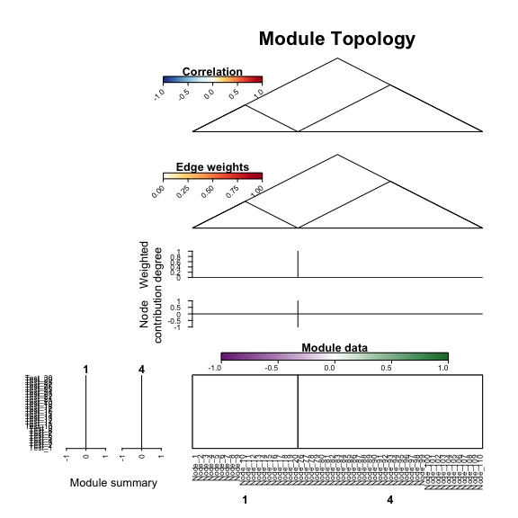
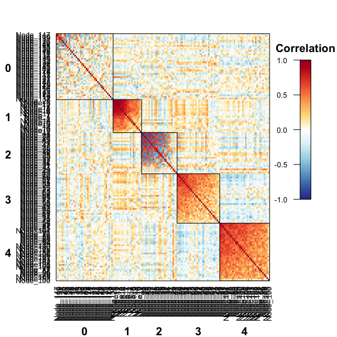

# NetRep
Scott Ritchie  
`r Sys.Date()`  


## Introduction

The *NetRep* package provides functions for assessing the preservation of network
modules across datasets.

This type of analysis is suitable for networks that can be meaningfully inferred
from multiple datasets. These include gene coexpression networks,
protein-protein interaction networks, and microbial co-occurence networks.
Modules within these networks consist of groups of nodes that are particularly
interesting: for example a group of tightly connected genes associated with a
disease, groups of genes annotated with the same term in the Gene Ontology
database, or groups of interacting microbial species, i.e. communities.

Application of this method can answer questions such as:

1. Do the relationships between genes in a module replicate in an independent 
   cohort? 
2. Are these gene coexpression modules preserved across tissues or tissue 
   specific?
3. Are these modules conserved across species? 
4. Are microbial communities preseved across multiple spatial locations?

A typical workflow for a NetRep analysis will usually contain the following 
steps, usually as separate scripts.

1. Calculate correlation structure and calculate network edges in each dataset 
   using some network inference algorithm.
2. Save the correlation structure and network adjacency matrices as 
   `bigMatrix` objects using the *NetRep* package.
3. Run the `modulePreservation` analysis to determine which modules are 
   preserved in your test dataset(s).
4. Visualise your modules of interest.
5. Calculate the topological properties of nodes for your modules of interest
   for downstream analysis. 

This tutorial will cover each of these steps, and is structured into sections 
for each step.

At the end of the tutorial, we provide advice for running these analyses on a
cluster. We recommend familiarising yourself with the *NetRep* workflow
before modifying the code for your own data since each step will take a 
substantial amount of time and should not be run interactively on large data.

## Data required for a NetRep analysis

Any *NetRep* analysis requires the following data to be provided and 
pre-computed for each dataset:

 - An adjacency matrix whose entries indicate the strength of the relationship 
   between nodes.
 - A matrix whose entries contain the correlation coefficient between each pair
   of nodes in the network.
 - A "data matrix", which contains the data used to calculate the correlation
   structure and infer the network, e.g. gene expression data.

Additionally, a vector containing the module label for each node in the network
is required for each discovery dataset.

There are many different approaches to network inference and module detection.
For gene expression data, we recommend using Weighted Gene Coexpression Network
Analysis through the [WGCNA][1] package. 

[1]: https://cran.r-project.org/web/packages/WGCNA/index.html

*NetRep* will also work with other types of data and networks defined through 
other algorithms, however you should read the sections on the module 
preservation statistics, sparse data, proportional data, and hypothesis testing 
in the details section of the help file for the `modulePreservation` function 
to determine the correct runtime parameters for your analysis.

## Tutorial data

For this vignette, we will use gene expression data simulated for two 
independent cohorts. The *discovery* dataset was simulated to contain four 
modules of varying size, two of which (Modules 1 and 4) replicate in the *test* 
dataset. 

This data is provided with the *NetRep* package: 


```r
library("NetRep")
data("NetRep")
```

Details of the simulation are provided in the documentation for the 
package data (see `help("NetRep-data")`).

Seven objects were loaded into the R session:

  - `discovery_data`: a matrix with 150 columns (genes) and 30 rows (samples) 
     whose entries correspond to the expression level of each gene in each 
     sample in the discovery dataset.
  - `discovery_correlation`: a matrix with 150 columns and 150 rows containing 
     the correlation-coefficients between each pair of genes calculated from the 
    `discovery_data` matrix.
  - `discovery_network`: a matrix with 150 columns and 150 rows containing the 
     network edge weights encoding the interaction strength between each pair of 
     genes in the discovery dataset.
  - `module_labels`: a named vector with 150 entries containing the module 
     assignment for each gene as identified in the discovery dataset.
  - `test_data`: a matrix with 150 columns (genes) and 30 rows (samples) whose 
     entries correspond to the expression level of each gene in each sample in 
     the test dataset.
  - `test_correlation`: a matrix with 150 columns and 150 rows containing the 
     correlation-coefficients between each pair of genes calculated from the 
    `test_data` matrix.
  - `test_network`: a matrix with 150 columns and 150 rows containing the 
     network edge weights encoding the interaction strength between each pair of
     genes in the test dataset.
     
## Saving the data in shared memory


The first step of a *NetRep* analysis is to save the *data*, *correlation* and 
*network* adjacency matrices as `bigMatrix` objects. This makes them accessible
to shared memory, meaning they can be accessed from multiple parallel R 
sessions. This is necessary for *NetRep* to run efficiently in parallel.

This step should be performed in a separate script to the rest of steps in the 
*NetRep* workflow. Typically, we would save these matrices as `bigMatrix` 
objects at the end of our network inference scripts to avoid long loading times
reading in large matrices into R. 


```r
# Save data in the 'bigMatrix' format in your current directory.
save.as.bigMatrix(discovery_data, backingfile="discovery_data.bm")
save.as.bigMatrix(discovery_correlation, backingfile="discovery_correlation.bm")
save.as.bigMatrix(discovery_network, backingfile="discovery_network.bm")
save.as.bigMatrix(test_data, backingfile="test_data.bm")
save.as.bigMatrix(test_correlation, backingfile="test_correlation.bm")
save.as.bigMatrix(test_network, backingfile="test_network.bm")

# Write out the module assignments vector to file to be read in by the module
# preservation script we write later.
write.csv(module_labels, file="discovery_modules.csv")
```

The `backingfile` argument tells *NetRep* where the data contained in each 
`bigMatrix` is stored. We can now instantly load these objects into future 
R sessions:


```r
discovery_network <- load.bigMatrix(backingfile="discovery_network.bm")
```

Elements in the `bigMatrix` object can be accessed just like regular matrices:


```r
discovery_network[1:5, 1:5]
```

```
##            Node_1       Node_2     Node_3     Node_4       Node_5
## Node_1 1.00000000 0.0327252311 0.20128943 0.08711442 0.0043783302
## Node_2 0.03272523 1.0000000000 0.07602808 0.12432401 0.0003559905
## Node_3 0.20128943 0.0760280823 1.00000000 0.51195703 0.0304185700
## Node_4 0.08711442 0.1243240086 0.51195703 1.00000000 0.0452988388
## Node_5 0.00437833 0.0003559905 0.03041857 0.04529884 1.0000000000
```

And converted back to `matrix` objects for functions that will only work on 
`matrix` objects:


```r
# This converts a `bigMatrix` to a `matrix` in R, but leaves the 
# backingfile on disk so you can still instantly load it in other
# R sessions using 'load.bigMatrix'
as.matrix(discovery_network)
```

## Running the module preservation analysis

Next, we will use *NetRep* to permutation test whether the topology of each 
module is preserved in our test dataset. This is by far the most 
computationally intense step of *NetRep*, so we will run this in its own
stand alone script. 

**It is important that this script is run in a new R session**. When running 
parallelised code, R will copy any objects in the current session to each of 
the parallel R sessions. By running this script in a new, empty, R session we 
will avoid unnecessary data dupication and keep memory usage to a minimum. 

First, we will load in the data and networks we saved as `bigMatrix` objects
in the previous script:


```r
# First, we need to load in the data we previously saved in 
# the `bigMatrix` format:
discovery_data <- load.bigMatrix("discovery_data.bm")
discovery_correlation <- load.bigMatrix("discovery_correlation.bm")
discovery_network <- load.bigMatrix("discovery_network.bm")
test_data <- load.bigMatrix("test_data.bm")
test_correlation <- load.bigMatrix("test_correlation.bm")
test_network <- load.bigMatrix("test_network.bm")

# As well as read in the module labels:
module_labels <- read.csv("module_labels.csv", stringsAsFactors=FALSE)
# Convert the 'data.frame' to a 'vector'
module_labels <- structure(module_labels[,2], names=module_labels[,1])
```
    
Next, we will combine these objects into list structures. All functions 
in the *NetRep* package have the following arguments:

 - `network`: a list of interaction networks, one for each dataset.
 - `data`: a list of data matrices used to infer those networks, one for each 
    dataset.
 - `correlation`: a list of matrices containing the pairwise correlation 
    coefficients between variables/nodes in each dataset.
 - `moduleAssignments`: a list of vectors, one for each *discovery* dataset, 
    containing the module assignments for each node in that dataset.
 - `modules`: a list of vectors, one vector for each *discovery* dataset, 
    containing the names of the modules from that dataset to analyse.
 - `discovery`: a vector indicating the names or indices to use as the 
   *discovery* datasets in the `network`, `data`, `correlation`, 
   `moduleAssignments`, and `modules` arguments.
 - `test`: a list of vectors, one vector for each *discovery* dataset, 
    containing the names or indices of the `network`, `data`, and `correlation` 
    argument lists to use as the *test* dataset(s) for the analysis of each 
   *discovery* dataset.
   
Each of these lists may contain any number of datasets. The names provided to
each list are used by the `discovery` and `test` arguments to determine which
datasets to compare. More than one  dataset can be specified in each of these 
arguments, for example when performing a pairwise analysis of gene coexpression
modules identified in multiple tissues:


```r
# Set up the input data structures for NetRep. 
data_list <- list(cohort1=discovery_data, cohort2=test_data)
correlation_list <- list(cohort1=discovery_correlation, cohort2=test_correlation)
network_list <- list(cohort1=discovery_network, cohort2=test_network)

# We do not need to set up a list for containing the 'module_labels' because
# there is only one "discovery" dataset.
```

Now we can use the `modulePreservation` function to assess the preservation 
of the four simulated modules from the discovery dateset, which we have labelled
"cohort1" in the test dataset, which we have labelled "cohort2". We will tell 
*NetRep* to run 10,000 permutations for this test, which we recommend as the 
minimum number of permutations for any test. 

*NetRep* will automatically detect the number of cores and use all but one.
On a single core machine the following should take an hour to an hour and a half 
to run with the tutorial data. On a laptop with 8 cores it took just under 10 
minutes when parallelised over seven cores.

For a full list of arguments and guidelines for choosing the right parameters
for your analysis, see the help file for the `modulePreservation` function.


```r
# Assess the preservation of modules in the test dataset 
preservation <- modulePreservation(
 data=data_list, correlation=correlation_list, network=network_list,
 moduleAssignments=module_labels, nPerm=10000, discovery="cohort1", 
 test="cohort2"
)

# Write out the results object:
saveRDS(preservation, "preservation-analysis-results.rds")
```


```
##  Validating user input...
##    Running on 7 cores.
##    Checking matrices for non-finite values...
##  User input ok!
##  Calculating preservation of network subsets from dataset "cohort1" in dataset "cohort2".
##    Calculating observed test statistics...
##    Calculating null distributions with 101 permutations...
##    Calculating P-values...
##    Collating results...
##  Cleaning up temporary objects...
##  Done!
```

Once this has run, we can read in the results in a new R session and look at 
the results. We will consider a module preserved if all its module preservation
statistics had a permutation test P-value < 0.01:


```r
preservation <- readRDS("preservation-analysis-results.rds")

# The results are stored as a list. The table of permutation test p-values is 
# stored in the element named "p.value". 
preservation$p.value

# Get the maximum permutation test p-value
max_pval <- apply(preservation$p.value, 1, max)
max_pval
```


```
##    avg.weight   coherence     cor.cor  cor.degree cor.contrib     avg.cor avg.contrib
## 1 0.009803922 0.009803922 0.009803922 0.009803922 0.009803922 0.009803922 0.009803922
## 2 0.980392157 0.990196078 0.019607843 0.607843137 0.009803922 0.039215686 0.009803922
## 3 0.990196078 0.980392157 0.382352941 0.774509804 0.725490196 1.000000000 0.784313725
## 4 0.009803922 0.009803922 0.009803922 0.009803922 0.009803922 0.009803922 0.009803922
```

```
##           1           2           3           4 
## 0.009803922 0.990196078 1.000000000 0.009803922
```

Only modules 1 and 4 are reproducible at this significance threshold.

## Visualising network modules

The topological properties measured by each module preservation statistic
can be visualised using `plotModule`. Since the permutation procedure takes
a long time, we will do this in another script. 

First, we need to load in the data and set up the input lists again. You may
find it convenient to create a separate loader script to do this:


```r
# First, we need to load in the data we previously saved in 
# the `bigMatrix` format:
discovery_data <- load.bigMatrix("discovery_data.bm")
discovery_correlation <- load.bigMatrix("discovery_correlation.bm")
discovery_network <- load.bigMatrix("discovery_network.bm")
test_data <- load.bigMatrix("test_data.bm")
test_correlation <- load.bigMatrix("test_correlation.bm")
test_network <- load.bigMatrix("test_network.bm")

# As well as read in the module labels:
module_labels <- read.csv("module_labels.csv", stringsAsFactors=FALSE)
# Convert the 'data.frame' to a 'vector'
module_labels <- structure(module_labels[,2], names=module_labels[,1])

# Set up the input data structures for NetRep. 
data_list <- list(cohort1=discovery_data, cohort2=test_data)
correlation_list <- list(cohort1=discovery_correlation, cohort2=test_correlation)
network_list <- list(cohort1=discovery_network, cohort2=test_network)
```

The  `plotModule` function takes the same input data as the `modulePreservation`
function: 
 
  - `network`: a list of network adjacency matrices, one for each dataset.
  - `correlation`: a list of matrices containing the correlation coefficients
     between nodes.
  - `data`: a list of data matrices used to infer the `network` and 
    `correlation` matrices.
  - `moduleAssignments`: a list of vectors, one for each *discovery* dataset,
     containing the module labels for each node.
  - `modules`: the modules we want to plot.
  - `discovery`: the dataset the modules were identified in.
  - `test`: the dataset we want to plot the modules in.

First, let's look at the four modules in the *discovery* dataset:


```r
plotModule(
  data=data_list, correlation=correlation_list, network=network_list, 
  moduleAssignments=module_labels, modules=c(1,2,3,4),
  discovery="cohort1", test="cohort1"
)
```

```
##  Validating user input...
##    Running on 7 cores.
##    Checking matrices for non-finite values...
##  User input ok!
##  Ordering nodes...
##  Ordering samples...
##  rendering plot components...
##  Cleaning up temporary objects...
##  Done!
```


The plot shows six elements of the network topology for the four modules:

 - A heatmap of the correlation structure between nodes within and between modules
 - A heatmap of the network edge weights within and between modules
 - The scaled weighted degree: a measure of how connected each node is within each module
 - The node contribution: the correlation between each node and the module's summary vector
 - A heatmap of the data matrix for each module
 - Each module's summary vector, a linear combination of the data across each 
   module's nodes that explains the most variance in the module's data matrix in
   the drawn dataset.
   

By default, nodes are ordered from left to right in decreasing order of 
*weighted degree*: the sum of edge weights within each module, i.e. how strongly
connected each node is within a module. For visualisation, the *weighted degree* 
is normalised within each module by the maximum value since the *weighted degree* 
of nodes can be dramatically different for modules of different sizes.

Samples are ordered from top to bottom in descending order of the module summary
profile of the left-most shown module.

When we plot the four modules in the test dataset, the nodes remain in the same
order: that is, in decreasing order of *weighted degree* in the *test* dataset.
This allows you to directly compare topology plots in each dataset of interest:


```r
plotModule(
  data=data_list, correlation=correlation_list, network=network_list, 
  moduleAssignments=module_labels, modules=c(1,2,3,4),
  discovery="cohort1", test="cohort2"
)
```

```
##  Validating user input...
##    Running on 7 cores.
##    Checking matrices for non-finite values...
##  User input ok!
##  Ordering nodes...
##  Ordering samples...
##  rendering plot components...
##  Cleaning up temporary objects...
##  Done!
```


Here we can clearly see from the correlation structure and network edge weight
heatmaps that modules 1 and 4 replicate.

By default, samples in this new plot are orderded in descending order of the 
left most module's summary profile, as calculated in the `test` dataset. If 
we're analysing module preservation across datasets drawn from the same samples,
e.g. different tissues, we can change the plot so that samples are ordered as
per the `discovery` dataset by setting `orderSamplesBy = "cohort1"`. We won't
do this here, since our two datasets have different samples.

We can change the order of nodes on the plot by setting `orderNodesBy`. If we
want to order nodes instead by our test dataset, we can set 
`orderNodesBy = "cohort2"`. However, a more informative setting is to tell 
`plotModule` to order the nodes by the average *weighted degree* across our
datasets. For preserved modules, this provides a more robust estimate of
the *weighted degree* and a more robust ordering of nodes by relative importance
to their module, so we will plot just modules 1 and 4


```r
plotModule(
  data=data_list, correlation=correlation_list, network=network_list, 
  moduleAssignments=module_labels, modules=c(1,4), # only the preserved modules
  discovery="cohort1", test="cohort2",
  orderNodesBy=c("cohort1", "cohort2") # this can be any number of datasets
)
```

```
##  Validating user input...
##    Running on 7 cores.
##    Checking matrices for non-finite values...
##  User input ok!
##  Ordering nodes...
##  Ordering samples...
##  rendering plot components...
##  Cleaning up temporary objects...
##  Done!
```


When drawing these plots yourself, you may need to tweak the appearance and
placement of the axis labels and legends, which may change depending on the
size of the device you are drawing the plot on. There is an extensive set of 
options for modifying the size and placement of the axes, legends, and their
individual elements. A list and description of these can be found in the 
"plot layout and device size" section of the help file for `plotModule`.

When tweaking these parameters, you should set the `dryRun` argument to `TRUE`.
When `dryRun = TRUE`, only the axes and labels will be drawn, avoiding the
computation time for the network properties, and the drawing time for the 
heatmaps, both of which may take some time for large modules. 

Let's tweak the previous plot:


```r
plotModule(
  data=data_list, correlation=correlation_list, network=network_list, 
  moduleAssignments=module_labels, modules=c(1,4),
  discovery="cohort1", test="cohort2",
  orderNodesBy=c("cohort1", "cohort2"),
  dryRun=TRUE
)
```

```
##  Validating user input...
##    Running on 7 cores.
##    Checking matrices for non-finite values...
##  User input ok!
##  rendering plot components...
##  Cleaning up temporary objects...
##  Done!
```



Note, since calculation of the network properties is skipped, the modules are
ordered as specified in the `modules` argument.

Now we can quickly iterate over parameters until we're happy with the plot:


```r
# Change the margins so the plot is more compressed. Alternatively we could 
# change the device window.
par(mar=c(3,10,3,10)) # bottom, left, top, right margin sizes
plotModule(
  data=data_list, correlation=correlation_list, network=network_list, 
  moduleAssignments=module_labels, modules=c(1,4),
  discovery="cohort1", test="cohort2",
  orderNodesBy=c("cohort1", "cohort2"),
  dryRun=TRUE, 
  # Title of the plot
  main = "Preserved modules", 
  # Use the maximum edge weight as the highest value instead of 1 in the
  # network heatmap
  netRange=NA,
  # Turn off the node and sample labels:
  plotNodeNames=FALSE, plotSampleNames=FALSE,
  # The distance from the bottom axis should the module labels be drawn:
  maxt.line=0,
  # The distance from the legend the legend titles should be drawn:
  legend.main.line=2
)
```

```
##  Validating user input...
##    Running on 7 cores.
##    Checking matrices for non-finite values...
##  User input ok!
##  rendering plot components...
##  Cleaning up temporary objects...
##  Done!
```


Once we're happy, we can turn off the `dryRun` parameter:


```r
par(mar=c(3,10,3,10)) 
plotModule(
  data=data_list, correlation=correlation_list, network=network_list, 
  moduleAssignments=module_labels, modules=c(1,4),
  discovery="cohort1", test="cohort2",
  orderNodesBy=c("cohort1", "cohort2"), main = "Preserved modules", 
  netRange=NA, plotNodeNames=FALSE, plotSampleNames=FALSE,
  maxt.line=0, legend.main.line=2
)
```

```
##  Validating user input...
##    Running on 7 cores.
##    Checking matrices for non-finite values...
##  User input ok!
##  Ordering nodes...
##  Ordering samples...
##  rendering plot components...
##  Cleaning up temporary objects...
##  Done!
```


We can also plot individual components of the plot separately. For example, 
a heatmap of the correlation structure:


```r
par(mar=c(5,5,3,3)) 
plotCorrelation(
  data=data_list, correlation=correlation_list, network=network_list, 
  moduleAssignments=module_labels, modules=0:4, discovery="cohort1",
  test="cohort1", symmetric=TRUE, orderModules=FALSE
)
```

```
##  Validating user input...
##    Running on 7 cores.
##    Checking matrices for non-finite values...
##  User input ok!
##  Ordering nodes...
##  rendering plot components...
##  Cleaning up temporary objects...
##  Done!
```



A full list of function and arguments for these individual plots can be found
at `help("plotTopology")`.

## Calculating the topological properties of a module

Finally, we can calculate the topological properties of the network modules for
use in other downstream analyses. Possible downstream analyses include:

 - Assessing the association between a module and a phenotype of interest 
   using the module summary profile.
 - Ranking nodes by relative importance using the weighted node degree
 
To do this, we use the `networkProperties` function, which takes the same 
input data as the `modulePreservation` function:
 
  - `network`: a list of network adjacency matrices, one for each dataset.
  - `correlation`: a list of matrices containing the correlation coefficients
     between nodes.
  - `data`: a list of data matrices used to infer the `network` and 
    `correlation` matrices.
  - `moduleAssignments`: a list of vectors, one for each *discovery* dataset,
     containing the module labels for each node.
  - `modules`: a vector or list of modules, one vector for each *discovery* 
     dataset, of modules we want to calculate the topological properties for.
  - `discovery`: a vector of datasets that the `modules` were identified in.
  - `test`: a vector or list of datasets, one vector for each *discovery* 
     dataset, in which the topological properties of the `modules` should be
     calculated in.
     
We will also do this in a separate script. First, we need to load in the data 
and set up the input lists again:


```r
# First, we need to load in the data we previously saved in 
# the `bigMatrix` format:
discovery_data <- load.bigMatrix("discovery_data.bm")
discovery_correlation <- load.bigMatrix("discovery_correlation.bm")
discovery_network <- load.bigMatrix("discovery_network.bm")
test_data <- load.bigMatrix("test_data.bm")
test_correlation <- load.bigMatrix("test_correlation.bm")
test_network <- load.bigMatrix("test_network.bm")

# As well as read in the module labels:
module_labels <- read.csv("module_labels.csv", stringsAsFactors=FALSE)
# Convert the 'data.frame' to a 'vector'
module_labels <- structure(module_labels[,2], names=module_labels[,1])

# Set up the input data structures for NetRep. 
data_list <- list(cohort1=discovery_data, cohort2=test_data)
correlation_list <- list(cohort1=discovery_correlation, cohort2=test_correlation)
network_list <- list(cohort1=discovery_network, cohort2=test_network)
```

Now we will calculate the network properties of modules 1 and 4, which were
preserved in "cohort2", in both datasets:


```r
properties <- networkProperties(
  data=data_list, correlation=correlation_list, network=network_list, 
  moduleAssignments=module_labels, 
  # Only calculate for the reproducible modules
  modules=c(1,4),
  # what dataset were the modules identified in?
  discovery="cohort1", 
  # which datasets do we want to calculate their properties in?
  test=c("cohort1", "cohort2")
)
```

```
##  Validating user input...
##    Running on 7 cores.
##    Checking matrices for non-finite values...
##  User input ok!
##  Calculating properties for:
##  Cleaning up temporary objects...
##  Done!
```

```r
# The summary profile of module 1 in the discovery dataset:
properties[["cohort1"]][["1"]][["summary"]]
```

```
##  Discovery_1  Discovery_2  Discovery_3  Discovery_4  Discovery_5  Discovery_6  Discovery_7 
##  -0.15173019  -0.09817810  -0.10356266  -0.21351111  -0.06424053  -0.25787365  -0.06191222 
##  Discovery_8  Discovery_9 Discovery_10 Discovery_11 Discovery_12 Discovery_13 Discovery_14 
##  -0.05886898   0.04544493   0.16790065  -0.16163254  -0.07158769  -0.16775343   0.39457572 
## Discovery_15 Discovery_16 Discovery_17 Discovery_18 Discovery_19 Discovery_20 Discovery_21 
##   0.10762551   0.25872801   0.01187731   0.57266243   0.15737963   0.02368060  -0.07088476 
## Discovery_22 Discovery_23 Discovery_24 Discovery_25 Discovery_26 Discovery_27 Discovery_28 
##   0.03726126  -0.13770047  -0.01978039  -0.06336512  -0.06360727  -0.30044215   0.14682841 
## Discovery_29 Discovery_30 
##   0.07036710   0.07229971
```

```r
# Along with the proportion of variance in the module data explained by the 
# summary profile:
properties[["cohort1"]][["1"]][["coherence"]]
```

```
## [1] 0.585781
```

```r
# The same information in the test dataset:
properties[["cohort2"]][["1"]][["summary"]]
```

```
##       Test_1       Test_2       Test_3       Test_4       Test_5       Test_6       Test_7 
## -0.099957918  0.061501299  0.043541623  0.051055323  0.056572949  0.136605203  0.116491092 
##       Test_8       Test_9      Test_10      Test_11      Test_12      Test_13      Test_14 
## -0.395294200 -0.099564626  0.092715774 -0.005526985  0.256963062  0.028746029 -0.076793357 
##      Test_15      Test_16      Test_17      Test_18      Test_19      Test_20      Test_21 
## -0.435677499  0.100475978 -0.339161521 -0.195830382 -0.104643904  0.050046780  0.238180614 
##      Test_22      Test_23      Test_24      Test_25      Test_26      Test_27      Test_28 
##  0.144114251  0.211841029  0.228291634 -0.171340087 -0.188991911 -0.093239829  0.063972325 
##      Test_29      Test_30 
##  0.278339356  0.046567899
```

```r
properties[["cohort2"]][["1"]][["coherence"]]
```

```
## [1] 0.6187688
```

## Running NetRep on a cluster

Estimating runtime and memory usage


