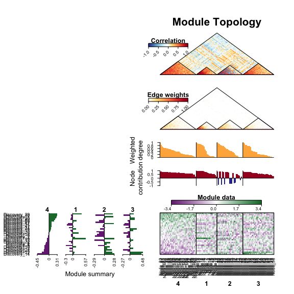
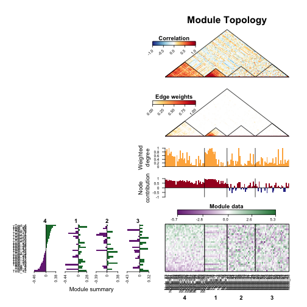
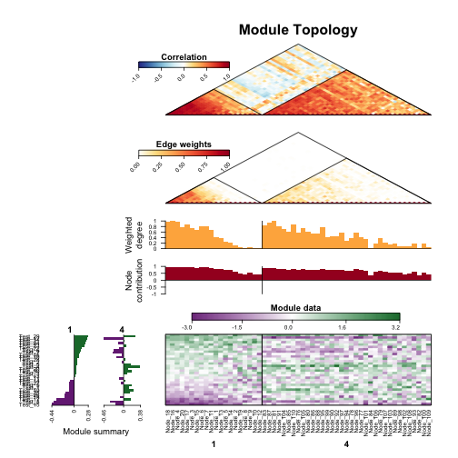
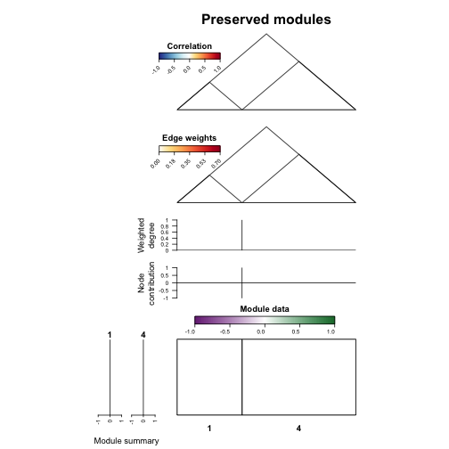
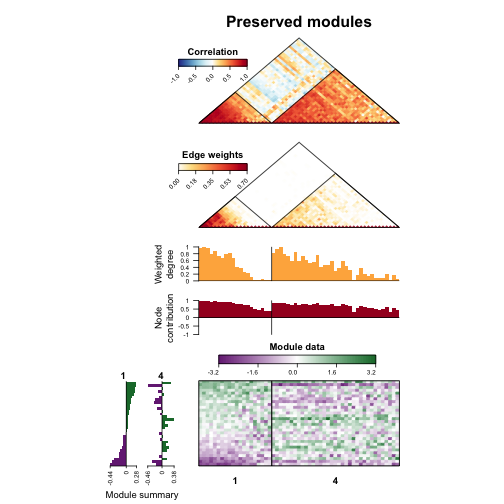
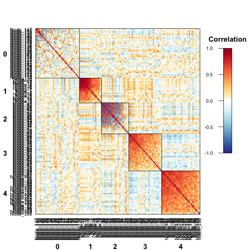
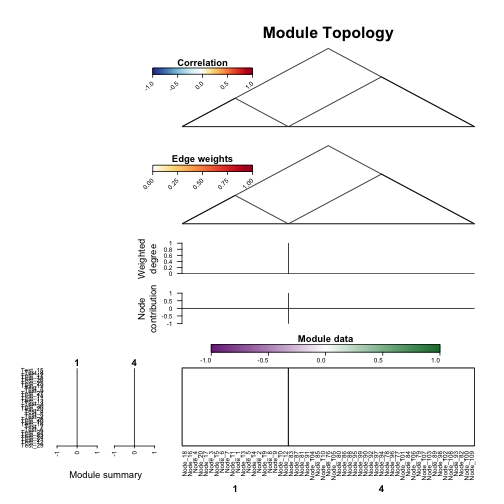
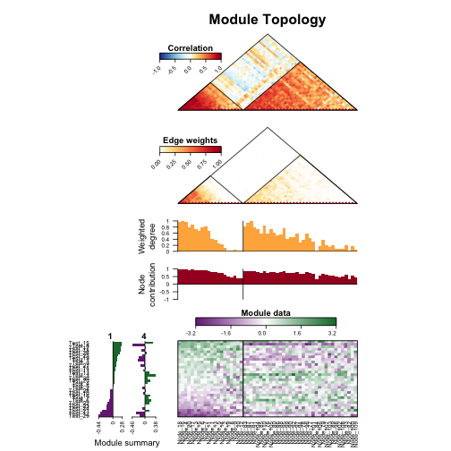

# NetRep
Scott Ritchie  
`r Sys.Date()`  


## Introduction

The **NetRep** package provides functions for assessing the preservation of network
modules across datasets.
  
This type of analysis is suitable for networks that can be meaningfully inferred
from multiple datasets. These include gene coexpression networks,
protein-protein interaction networks, and microbial co-occurence networks.
Modules within these networks consist of groups of nodes that are particularly
interesting: for example a group of tightly connected genes associated with a
disease, groups of genes annotated with the same term in the Gene Ontology
database, or groups of interacting microbial species, i.e. communities.

Application of this method can answer questions such as:

1. Do the relationships between genes in a module replicate in an independent 
   cohort? 
2. Are these gene coexpression modules preserved across tissues or tissue 
   specific?
3. Are these modules conserved across species? 
4. Are microbial communities preseved across multiple spatial locations?

A typical workflow for a **NetRep** analysis will usually contain the following 
steps, usually as separate scripts.

1. Calculate correlation structure and calculate network edges in each dataset 
   using some network inference algorithm.
2. Load in these data and set up the input lists for NetRep's functions.
3. Run the `modulePreservation` analysis to determine which modules are 
   preserved in your test dataset(s).
4. Visualise your modules of interest.
5. Calculate the topological properties of nodes for your modules of interest
   for downstream analysis. 

In this tutorial we will cover steps 2-5, running **NetRep** on large datasets,
and running **NetRep** on a cluster with a job submission system.

We recommend familiarising yourself with the **NetRep** workflow
before modifying the code for your own data since each step can take a 
substantial amount of time on large datasets, for which **NetRep** should not be 
run interactively.

## Data required for a NetRep analysis

Any **NetRep** analysis requires the following data to be provided and 
pre-computed for each dataset:

 - An adjacency matrix whose entries indicate the strength of the relationship 
   between nodes.
 - A matrix whose entries contain the correlation coefficient between each pair
   of nodes in the network.
 - a vector containing the module/group label for each node in the network
   is required for each discovery dataset.
 - Optionally, a "data matrix", which contains the data used to calculate the 
   correlation structure and infer the network, e.g. gene expression data.

There are many different approaches to network inference and module detection.
For gene expression data, we recommend using Weighted Gene Coexpression Network
Analysis through the [WGCNA][1] package. 

[1]: https://cran.r-project.org/web/packages/WGCNA/index.html

**NetRep** will also work with other types of data and networks defined through 
other algorithms, however you should read the sections on the module 
preservation statistics, sparse data, proportional data, and hypothesis testing 
in the details section of the help file for the `modulePreservation` function 
to determine the correct runtime parameters for your analysis.

### Tutorial data

For this vignette, we will use gene expression data simulated for two 
independent cohorts. The *discovery* dataset was simulated to contain four 
modules of varying size, two of which (Modules 1 and 4) replicate in the *test* 
dataset. 

Details of the simulation are provided in the documentation for the 
package data (see `help("NetRep-data")`).

This data is provided with the **NetRep** package: 


```r
library("NetRep")
data("NetRep")
```

Seven objects were loaded into the R session:

  - `discovery_data`: a matrix with 150 columns (genes) and 30 rows (samples) 
     whose entries correspond to the expression level of each gene in each 
     sample in the discovery dataset.
  - `discovery_correlation`: a matrix with 150 columns and 150 rows containing 
     the correlation-coefficients between each pair of genes calculated from the 
    `discovery_data` matrix.
  - `discovery_network`: a matrix with 150 columns and 150 rows containing the 
     network edge weights encoding the interaction strength between each pair of 
     genes in the discovery dataset.
  - `module_labels`: a named vector with 150 entries containing the module 
     assignment for each gene as identified in the discovery dataset. Here, 
     we've given genes that are not part of any module/group the label "0".
  - `test_data`: a matrix with 150 columns (genes) and 30 rows (samples) whose 
     entries correspond to the expression level of each gene in each sample in 
     the test dataset.
  - `test_correlation`: a matrix with 150 columns and 150 rows containing the 
     correlation-coefficients between each pair of genes calculated from the 
    `test_data` matrix.
  - `test_network`: a matrix with 150 columns and 150 rows containing the 
     network edge weights encoding the interaction strength between each pair of
     genes in the test dataset.
     
### Setting up the input lists

Next, we will combine these objects into list structures. All functions 
in the **NetRep** package take the following arguments:

 - `network`: a list of interaction networks, one for each dataset.
 - `data`: a list of data matrices used to infer those networks, one for each 
    dataset.
 - `correlation`: a list of matrices containing the pairwise correlation 
    coefficients between variables/nodes in each dataset.
 - `moduleAssignments`: a list of vectors, one for each *discovery* dataset, 
    containing the module assignments for each node in that dataset.
 - `modules`: a list of vectors, one vector for each *discovery* dataset, 
    containing the names of the modules from that dataset to analyse.
 - `discovery`: a vector indicating the names or indices to use as the 
   *discovery* datasets in the `network`, `data`, `correlation`, 
   `moduleAssignments`, and `modules` arguments.
 - `test`: a list of vectors, one vector for each *discovery* dataset, 
    containing the names or indices of the `network`, `data`, and `correlation` 
    argument lists to use as the *test* dataset(s) for the analysis of each 
   *discovery* dataset.
   
Each of these lists may contain any number of datasets. The names provided to
each list are used by the `discovery` and `test` arguments to determine which
datasets to compare. More than one  dataset can be specified in each of these 
arguments, for example when performing a pairwise analysis of gene coexpression
modules identified in multiple tissues.


```r
# Set up the input data structures for NetRep. We will call these datasets 
# "cohort1" and "cohort2" to avoid confusion with the "discovery" and "test"
# arguments in NetRep's functions:
data_list <- list(cohort1=discovery_data, cohort2=test_data)
correlation_list <- list(cohort1=discovery_correlation, cohort2=test_correlation)
network_list <- list(cohort1=discovery_network, cohort2=test_network)

# We do not need to set up a list for containing the 'module_labels' because
# there is only one "discovery" dataset.
```

Typically we would put the code that reads in our data and sets up the input
lists in its own script. This loading script can then be called from our 
scripts where we calculate the module preservation, visualise our networks, 
and calculate the network properties.

## Running the module preservation analysis

Now we will use **NetRep** to permutation test whether the topology of each 
module is preserved in our test dataset using the `modulePreservation` 
function. This function calculates seven module preservation statistics for 
each module, then runs permutations in the test network to determine whether 
the are significant. For more details on these statistics, see the helpfile:
`help("modulePreservation")`.

We will run 10,000 permutations, and split calculation across 2 threads so that
calculations are run in parallel. By default, `modulePreservaton` will test the
preservation of all modules, excluding the network background which is assumed
to have the label "0":


```r
# Assess the preservation of modules in the test dataset.
preservation <- modulePreservation(
 network=network_list, data=data_list, correlation=correlation_list, 
 moduleAssignments=module_labels, discovery="cohort1", test="cohort2", 
 nPerm=10000, nThreads=2
)
```

```
## [2016-06-10 22:51:53 AEST] Validating user input...
## [2016-06-10 22:51:53 AEST]   Checking matrices for problems...
## [2016-06-10 22:51:53 AEST] Input ok!
## [2016-06-10 22:51:53 AEST] Calculating preservation of network subsets from dataset "cohort1" in
##                            dataset "cohort2".
## [2016-06-10 22:51:53 AEST]   Pre-computing intermediate properties in dataset "cohort1"...
## [2016-06-10 22:51:53 AEST]   Calculating observed test statistics...
## [2016-06-10 22:51:53 AEST]   Generating null distributions from 10000 permutations using 2
##                              threads...
## 
## 
    0% completed.
   10% completed.
   20% completed.
   30% completed.
   40% completed.
   50% completed.
   60% completed.
   69% completed.
   79% completed.
   89% completed.
   99% completed.
  100% completed.
## 
## [2016-06-10 22:52:04 AEST]   Calculating P-values...
## [2016-06-10 22:52:04 AEST]   Collating results...
## [2016-06-10 22:52:04 AEST] Done!
```

There are many arguments to control how `modulePreservation` runs, for a full
list see its helpfile: `help("modulePreservation")`.

The results returned by `modulePreservation` for each dataset comparison are a 
list containing seven elements:

 - `nulls` the null distribution for each statstic and module generated by the
    permutation procedure.
 - `observed` the observed value of each module preservation statistic for each
   module.
 - `p.values` the p-values for each module preservation statistic for each 
   module.
 - `nVarsPresent` the number of variables in the *discovery* dataset that had 
   corresponding measurements in the *test* dataset.
 - `propVarsPresent` the proportion of nodes in each module that had 
   corresponding measurements in the *test* dataset.
 - `totalSize` the total number of nodes in the *discovery* network.
 - `alternative` the alternate hypothesis used in the test (e.g. "the module 
   preservation statistics are higher than expected by chance").

If the *test* dataset has also had module discovery performed in it, a 
contigency table tabulating the overlap in module content between the two 
datasets is returned.

Let's take a look at our results:


```r
preservation$p.value
```

```
##   avg.weight  coherence    cor.cor cor.degree cor.contrib    avg.cor avg.contrib
## 1 0.00009999 0.00009999 0.00009999 0.00009999  0.00009999 0.00009999  0.00009999
## 2 0.97870213 0.96600340 0.00869913 0.56324368  0.00299970 0.01559844  0.00519948
## 3 0.98890111 0.98600140 0.42515748 0.80941906  0.71272873 0.99310069  0.88211179
## 4 0.00009999 0.00009999 0.00009999 0.00009999  0.00039996 0.00009999  0.00009999
```

We will consider a module preserved if all its module preservation
statistics had a permutation test P-value < 0.01:


```r
# Get the maximum permutation test p-value
max_pval <- apply(preservation$p.value, 1, max)
max_pval
```

```
##          1          2          3          4 
## 0.00009999 0.97870213 0.99310069 0.00039996
```

Only modules 1 and 4 are reproducible at this significance threshold.

## Visualising network modules

The topological properties measured by each module preservation statistic
can be visualised using `plotModule`.

The  `plotModule` function takes the same input data as the `modulePreservation`
function: 
 
  - `network`: a list of network adjacency matrices, one for each dataset.
  - `correlation`: a list of matrices containing the correlation coefficients
     between nodes.
  - `data`: a list of data matrices used to infer the `network` and 
    `correlation` matrices.
  - `moduleAssignments`: a list of vectors, one for each *discovery* dataset,
     containing the module labels for each node.
  - `modules`: the modules we want to plot.
  - `discovery`: the dataset the modules were identified in.
  - `test`: the dataset we want to plot the modules in.

First, let's look at the four modules in the *discovery* dataset:


```r
plotModule(
  data=data_list, correlation=correlation_list, network=network_list, 
  moduleAssignments=module_labels, modules=c(1,2,3,4),
  discovery="cohort1", test="cohort1"
)
```

```
## [2016-06-10 22:52:04 AEST] Validating user input...
## [2016-06-10 22:52:04 AEST]   Checking matrices for problems...
## [2016-06-10 22:52:05 AEST] User input ok!
## [2016-06-10 22:52:05 AEST] Calculating network properties in dataset "cohort1"...
## [2016-06-10 22:52:05 AEST] Ordering nodes...
## [2016-06-10 22:52:05 AEST] Ordering samples...
## [2016-06-10 22:52:05 AEST] rendering plot components...
## [2016-06-10 22:52:07 AEST] Done!
```



The plot shows six elements of the network topology for the four modules:

 - A heatmap of the correlation structure between nodes within and between modules
 - A heatmap of the network edge weights within and between modules
 - The scaled weighted degree: a measure of how connected each node is within each module
 - The node contribution: the correlation between each node and the module's summary vector
 - A heatmap of the data matrix for each module
 - Each module's summary vector, a linear combination of the data across each 
   module's nodes that explains the most variance in the module's data matrix in
   the drawn dataset.
   

By default, nodes are ordered from left to right in decreasing order of 
*weighted degree*: the sum of edge weights within each module, i.e. how strongly
connected each node is within a module. For visualisation, the *weighted degree* 
is normalised within each module by the maximum value since the *weighted degree* 
of nodes can be dramatically different for modules of different sizes.

Samples are ordered from top to bottom in descending order of the module summary
profile of the left-most shown module.

When we plot the four modules in the test dataset, the nodes remain in the same
order: that is, in decreasing order of *weighted degree* in the *test* dataset.
This allows you to directly compare topology plots in each dataset of interest:


```r
plotModule(
  data=data_list, correlation=correlation_list, network=network_list, 
  moduleAssignments=module_labels, modules=c(1,2,3,4),
  discovery="cohort1", test="cohort2"
)
```

```
## [2016-06-10 22:52:09 AEST] Validating user input...
## [2016-06-10 22:52:09 AEST]   Checking matrices for problems...
## [2016-06-10 22:52:09 AEST] User input ok!
## [2016-06-10 22:52:09 AEST] Calculating network properties in dataset "cohort1"...
## [2016-06-10 22:52:09 AEST] Calculating network properties in dataset "cohort2"...
## [2016-06-10 22:52:09 AEST] Ordering nodes...
## [2016-06-10 22:52:09 AEST] Ordering samples...
## [2016-06-10 22:52:10 AEST] rendering plot components...
## [2016-06-10 22:52:12 AEST] Done!
```



Here we can clearly see from the correlation structure and network edge weight
heatmaps that modules 1 and 4 replicate.

By default, samples in this new plot are orderded in descending order of the 
left most module's summary profile, as calculated in the `test` dataset. If 
we're analysing module preservation across datasets drawn from the same samples,
e.g. different tissues, we can change the plot so that samples are ordered as
per the `discovery` dataset by setting `orderSamplesBy = "cohort1"`. We won't
do this here, since our two datasets have different samples.

We can change the order of nodes on the plot by setting `orderNodesBy`. If we
want to order nodes instead by our test dataset, we can set 
`orderNodesBy = "cohort2"`. However, a more informative setting is to tell 
`plotModule` to order the nodes by the average *weighted degree* across our
datasets. For preserved modules, this provides a more robust estimate of
the *weighted degree* and a more robust ordering of nodes by relative importance
to their module, so we will plot just modules 1 and 4


```r
plotModule(
  data=data_list, correlation=correlation_list, network=network_list, 
  moduleAssignments=module_labels, modules=c(1,4), # only the preserved modules
  discovery="cohort1", test="cohort2",
  orderNodesBy=c("cohort1", "cohort2") # this can be any number of datasets
)
```

```
## [2016-06-10 22:52:13 AEST] Validating user input...
## [2016-06-10 22:52:13 AEST]   Checking matrices for problems...
## [2016-06-10 22:52:13 AEST] User input ok!
## [2016-06-10 22:52:13 AEST] Calculating network properties in dataset "cohort1"...
## [2016-06-10 22:52:14 AEST] Calculating network properties in dataset "cohort2"...
## [2016-06-10 22:52:14 AEST] Ordering nodes...
## [2016-06-10 22:52:14 AEST] Ordering samples...
## [2016-06-10 22:52:14 AEST] rendering plot components...
## [2016-06-10 22:52:15 AEST] Done!
```



### Tweaking the plot appearance

When drawing these plots yourself, you may need to tweak the appearance and
placement of the axis labels and legends, which may change depending on the
size of the device you are drawing the plot on. There is an extensive set of 
options for modifying the size and placement of the axes, legends, and their
individual elements. A list and description of these can be found in the 
"plot layout and device size" section of the help file for `plotModule`.

When tweaking these parameters, you should set the `dryRun` argument to `TRUE`.
When `dryRun = TRUE`, only the axes and labels will be drawn, avoiding the
computation time for the network properties, and the drawing time for the 
heatmaps, both of which may take some time for large modules. 

Let's tweak the previous plot:


```r
plotModule(
  data=data_list, correlation=correlation_list, network=network_list, 
  moduleAssignments=module_labels, modules=c(1,4),
  discovery="cohort1", test="cohort2",
  orderNodesBy=c("cohort1", "cohort2"),
  dryRun=TRUE
)
```

```
## [2016-06-10 22:52:15 AEST] Validating user input...
## [2016-06-10 22:52:15 AEST]   Checking matrices for problems...
## [2016-06-10 22:52:15 AEST] User input ok!
## [2016-06-10 22:52:15 AEST] Calculating network properties in dataset "cohort1"...
## [2016-06-10 22:52:16 AEST] Calculating network properties in dataset "cohort2"...
## [2016-06-10 22:52:16 AEST] Ordering nodes...
## [2016-06-10 22:52:16 AEST] Ordering samples...
## [2016-06-10 22:52:16 AEST] rendering plot components...
## [2016-06-10 22:52:16 AEST] Done!
```


Note, since calculation of the network properties is skipped, the modules are
ordered as specified in the `modules` argument.

Now we can quickly iterate over parameters until we're happy with the plot:


```r
# Change the margins so the plot is more compressed. Alternatively we could 
# change the device window.
par(mar=c(3,10,3,10)) # bottom, left, top, right margin sizes
plotModule(
  data=data_list, correlation=correlation_list, network=network_list, 
  moduleAssignments=module_labels, modules=c(1,4),
  discovery="cohort1", test="cohort2",
  orderNodesBy=c("cohort1", "cohort2"),
  dryRun=TRUE, 
  # Title of the plot
  main = "Preserved modules", 
  # Use the maximum edge weight as the highest value instead of 1 in the
  # network heatmap
  netRange=NA,
  # Turn off the node and sample labels:
  plotNodeNames=FALSE, plotSampleNames=FALSE,
  # The distance from the bottom axis should the module labels be drawn:
  maxt.line=0,
  # The distance from the legend the legend titles should be drawn:
  legend.main.line=2
)
```

```
## [2016-06-10 22:52:16 AEST] Validating user input...
## [2016-06-10 22:52:16 AEST]   Checking matrices for problems...
## [2016-06-10 22:52:16 AEST] User input ok!
## [2016-06-10 22:52:17 AEST] Calculating network properties in dataset "cohort1"...
## [2016-06-10 22:52:17 AEST] Calculating network properties in dataset "cohort2"...
## [2016-06-10 22:52:17 AEST] Ordering nodes...
## [2016-06-10 22:52:17 AEST] Ordering samples...
## [2016-06-10 22:52:17 AEST] rendering plot components...
## [2016-06-10 22:52:17 AEST] Done!
```



Once we're happy, we can turn off the `dryRun` parameter:


```r
par(mar=c(3,10,3,10)) 
plotModule(
  data=data_list, correlation=correlation_list, network=network_list, 
  moduleAssignments=module_labels, modules=c(1,4),
  discovery="cohort1", test="cohort2",
  orderNodesBy=c("cohort1", "cohort2"), main = "Preserved modules", 
  netRange=NA, plotNodeNames=FALSE, plotSampleNames=FALSE,
  maxt.line=0, legend.main.line=2
)
```

```
## [2016-06-10 22:52:17 AEST] Validating user input...
## [2016-06-10 22:52:17 AEST]   Checking matrices for problems...
## [2016-06-10 22:52:17 AEST] User input ok!
## [2016-06-10 22:52:18 AEST] Calculating network properties in dataset "cohort1"...
## [2016-06-10 22:52:18 AEST] Calculating network properties in dataset "cohort2"...
## [2016-06-10 22:52:18 AEST] Ordering nodes...
## [2016-06-10 22:52:18 AEST] Ordering samples...
## [2016-06-10 22:52:18 AEST] rendering plot components...
## [2016-06-10 22:52:19 AEST] Done!
```



### Plotting the individual components 

We can also plot individual components of the plot separately. For example, 
a heatmap of the correlation structure:


```r
par(mar=c(5,5,4,4)) 
plotCorrelation(
  data=data_list, correlation=correlation_list, network=network_list, 
  moduleAssignments=module_labels, modules=0:4, discovery="cohort1",
  test="cohort1", symmetric=TRUE, orderModules=FALSE
)
```

```
## [2016-06-10 22:52:19 AEST] Validating user input...
## [2016-06-10 22:52:19 AEST]   Checking matrices for problems...
## [2016-06-10 22:52:19 AEST] User input ok!
## [2016-06-10 22:52:19 AEST] Calculating network properties in dataset "cohort1"...
## [2016-06-10 22:52:19 AEST] Ordering nodes...
## [2016-06-10 22:52:19 AEST] rendering plot components...
## [2016-06-10 22:52:23 AEST] Done!
```



A full list of function and arguments for these individual plots can be found
at `help("plotTopology")`.

## Calculating the topological properties of a module

Finally, we can calculate the topological properties of the network modules for
use in other downstream analyses. Possible downstream analyses include:

 - Assessing the association between a module and a phenotype of interest 
   using the module summary profile.
 - Ranking nodes by relative importance using the weighted node degree
 
To do this, we use the `networkProperties` function, which takes the same 
input data as the `modulePreservation` function. We will calculate the network 
properties of modules 1 and 4, which were preserved in "cohort2", in both 
datasets:


```r
properties <- networkProperties(
  data=data_list, correlation=correlation_list, network=network_list, 
  moduleAssignments=module_labels, 
  # Only calculate for the reproducible modules
  modules=c(1,4),
  # what dataset were the modules identified in?
  discovery="cohort1", 
  # which datasets do we want to calculate their properties in?
  test=c("cohort1", "cohort2")
)
```

```
## [2016-06-10 22:52:25 AEST] Validating user input...
## [2016-06-10 22:52:25 AEST]   Checking matrices for problems...
## [2016-06-10 22:52:25 AEST] User input ok!
## [2016-06-10 22:52:25 AEST] Calculating network properties in dataset "cohort1"...
## [2016-06-10 22:52:26 AEST] Calculating network properties in dataset "cohort2"...
## [2016-06-10 22:52:26 AEST] Done!
```

```r
# The summary profile of module 1 in the discovery dataset:
properties[["cohort1"]][["1"]][["summary"]]
```

```
##  Discovery_1  Discovery_2  Discovery_3  Discovery_4  Discovery_5  Discovery_6  Discovery_7 
##  -0.15173019  -0.09817810  -0.10356266  -0.21351111  -0.06424053  -0.25787365  -0.06191222 
##  Discovery_8  Discovery_9 Discovery_10 Discovery_11 Discovery_12 Discovery_13 Discovery_14 
##  -0.05886898   0.04544493   0.16790065  -0.16163254  -0.07158769  -0.16775343   0.39457572 
## Discovery_15 Discovery_16 Discovery_17 Discovery_18 Discovery_19 Discovery_20 Discovery_21 
##   0.10762551   0.25872801   0.01187731   0.57266243   0.15737963   0.02368060  -0.07088476 
## Discovery_22 Discovery_23 Discovery_24 Discovery_25 Discovery_26 Discovery_27 Discovery_28 
##   0.03726126  -0.13770047  -0.01978039  -0.06336512  -0.06360727  -0.30044215   0.14682841 
## Discovery_29 Discovery_30 
##   0.07036710   0.07229971
```

```r
# Along with the proportion of variance in the module data explained by the 
# summary profile:
properties[["cohort1"]][["1"]][["coherence"]]
```

```
## [1] 0.585781
```

```r
# The same information in the test dataset:
properties[["cohort2"]][["1"]][["summary"]]
```

```
##       Test_1       Test_2       Test_3       Test_4       Test_5       Test_6       Test_7 
## -0.099957918  0.061501299  0.043541623  0.051055323  0.056572949  0.136605203  0.116491092 
##       Test_8       Test_9      Test_10      Test_11      Test_12      Test_13      Test_14 
## -0.395294200 -0.099564626  0.092715774 -0.005526985  0.256963062  0.028746029 -0.076793357 
##      Test_15      Test_16      Test_17      Test_18      Test_19      Test_20      Test_21 
## -0.435677499  0.100475978 -0.339161521 -0.195830382 -0.104643904  0.050046780  0.238180614 
##      Test_22      Test_23      Test_24      Test_25      Test_26      Test_27      Test_28 
##  0.144114251  0.211841029  0.228291634 -0.171340087 -0.188991911 -0.093239829  0.063972325 
##      Test_29      Test_30 
##  0.278339356  0.046567899
```

```r
properties[["cohort2"]][["1"]][["coherence"]]
```

```
## [1] 0.6187688
```

## Analysing large datasets with **NetRep**


**NetRep** provides an additional class, `disk.matrix`, which stores a file 
path to a matrix on disk, along with meta-data on how to read that file. This
allows **NetRep**'s functions to load matrices into RAM only when required, so
that only one dataset is kept in memory at any point in time. This is useful
when working on systems with limited RAM.

The `disk.matrix` class recognises two types of files: matrix data saved in 
table format (i.e. a file that is normally read in by `read.table` or 
`read.csv`), and serialized R objects saved through `saveRDS`. Serialized R 
objects are much faster to load into R than files in table format, but cannot 
be read by other programs. We recommend storing your files in both formats 
unless you are low on disk space. 

First, we need to make sure our matrices are saved to disk. Matrices can be
converted to `disk.matrix` objects directly through the `as.disk.matrix` 
function:


```r
# serialize=TRUE will save the data using 'saveRDS'. 
# serialize=FALSE will save the data as a tab-separated file ('sep="\t"').
discovery_data <- as.disk.matrix(
  x=discovery_data, 
  file="discovery_data.rds", 
  serialize=TRUE)
discovery_correlation <- as.disk.matrix(
  x=discovery_correlation, 
  file="discovery_correlation.rds", 
  serialize=TRUE)
discovery_network <- as.disk.matrix(
  x=discovery_network, 
  file="discovery_network.rds",
  serialize=TRUE)
test_data <- as.disk.matrix(
  x=test_data, 
  file="test_data.rds", 
  serialize=TRUE)
test_correlation <- as.disk.matrix(
  x=test_correlation, 
  file="test_correlation.rds", 
  serialize=TRUE)
test_network <- as.disk.matrix(
  x=test_network, 
  file="test_network.rds",
  serialize=TRUE)
```

Now, these matrices are stored simply as file paths:


```r
test_network
```

```
## Pointer to matrix stored at test_network.rds
```

To load the matrix into R we can convert it back to a `matrix`:


```r
as.matrix(test_network)[1:5, 1:5]
```

```
##            Node_1       Node_2     Node_3     Node_4       Node_5
## Node_1 1.00000000 0.0284607734 0.29433703 0.27292044 0.0774910679
## Node_2 0.02846077 1.0000000000 0.04594941 0.04747009 0.0001403167
## Node_3 0.29433703 0.0459494090 1.00000000 0.48140887 0.1392228920
## Node_4 0.27292044 0.0474700916 0.48140887 1.00000000 0.0996614770
## Node_5 0.07749107 0.0001403167 0.13922289 0.09966148 1.0000000000
```

Once our matrices are saved to disk, we can load them as `disk.matrix` objects 
in new R sessions using `attach.disk.matrix`. Typically, we would save our 
matrices to disk after running our network inference pipeline, then use 
`attach.disk.matrix` in our new R session when we run **NetRep** at some point
in the future.


```r
# If files are saved as tables, set 'serialized=FALSE' and specify arguments 
# that would normally be provided to 'read.table'. Note: this function doesnt
# check whether the file can actually be read in as a matrix!
discovery_data <- attach.disk.matrix("discovery_data.rds")
discovery_correlation <- attach.disk.matrix("discovery_correlation.rds")
discovery_network <- attach.disk.matrix("discovery_network.rds")
test_data <- attach.disk.matrix("test_data.rds")
test_correlation <- attach.disk.matrix("test_correlation.rds")
test_network <- attach.disk.matrix("test_network.rds")
```

And we need to set up our input lists for **NetRep**:


```r
data_list <- list(cohort1=discovery_data, cohort2=test_data)
correlation_list <- list(cohort1=discovery_correlation, cohort2=test_correlation)
network_list <- list(cohort1=discovery_network, cohort2=test_network)
```

Now we can run our analyses as previously described in the tutorial:


```r
# Assess the preservation of modules in the test dataset.
preservation <- modulePreservation(
 network=network_list, data=data_list, correlation=correlation_list, 
 moduleAssignments=module_labels, discovery="cohort1", test="cohort2", 
 nPerm=10000, nThreads=2
)
```

```
## [2016-06-10 22:52:26 AEST] Validating user input...
## [2016-06-10 22:52:26 AEST]   Loading matrices of dataset "cohort2" into RAM...
## [2016-06-10 22:52:26 AEST]   Checking matrices for problems...
## [2016-06-10 22:52:26 AEST]   Unloading dataset from RAM...
## [2016-06-10 22:52:26 AEST]   Loading matrices of dataset "cohort1" into RAM...
## [2016-06-10 22:52:26 AEST]   Checking matrices for problems...
## [2016-06-10 22:52:26 AEST] Input ok!
## [2016-06-10 22:52:26 AEST] Calculating preservation of network subsets from dataset "cohort1" in
##                            dataset "cohort2".
## [2016-06-10 22:52:26 AEST]   Pre-computing intermediate properties in dataset "cohort1"...
## [2016-06-10 22:52:26 AEST]   Unloading dataset from RAM...
## [2016-06-10 22:52:26 AEST]   Loading matrices of dataset "cohort2" into RAM...
## [2016-06-10 22:52:26 AEST]   Calculating observed test statistics...
## [2016-06-10 22:52:26 AEST]   Generating null distributions from 10000 permutations using 2
##                              threads...
## 
## 
    0% completed.
   10% completed.
   20% completed.
   30% completed.
   41% completed.
   51% completed.
   61% completed.
   71% completed.
   80% completed.
   90% completed.
  100% completed.
## 
## [2016-06-10 22:52:36 AEST]   Calculating P-values...
## [2016-06-10 22:52:36 AEST]   Collating results...
## [2016-06-10 22:52:36 AEST] Unloading dataset from RAM...
## [2016-06-10 22:52:37 AEST] Done!
```

You can now see that `modulePreservation` loads and unloads the two datasets
as required.

### Using `disk.matrix` with the plotting functions

Earlier in the tutorial, we showed you how to use the `dryRun` argument to 
quickly set up the plot axes before actually drawing the module(s) of interest.
This does not work so well with `disk.matrix` input since we need to know which
nodes and samples are being drawn to display their labels. This means that all
datasets used for the plot need to be loaded, which can be quite slow if the
datasets are large. There are two solutions: (1) do not use `disk.matrix` so
that all matrices are kept in memory, or (2) use the `nodeOrder` and 
`sampleOrder` functions to determine the nodes and samples that will be on the
plot in advance:


```r
# Determine the nodes and samples on a plot in advance:
nodesToPlot <- nodeOrder(
  data=data_list, correlation=correlation_list, network=network_list, 
  moduleAssignments=module_labels, modules=c(1,4), discovery="cohort1", 
  test=c("cohort1", "cohort2"), mean=TRUE
)
```

```
## [2016-06-10 22:52:37 AEST] Validating user input...
## [2016-06-10 22:52:37 AEST]   Loading matrices of dataset "cohort2" into RAM...
## [2016-06-10 22:52:37 AEST]   Checking matrices for problems...
## [2016-06-10 22:52:37 AEST]   Unloading dataset from RAM...
## [2016-06-10 22:52:37 AEST]   Loading matrices of dataset "cohort1" into RAM...
## [2016-06-10 22:52:37 AEST]   Checking matrices for problems...
## [2016-06-10 22:52:37 AEST] User input ok!
## [2016-06-10 22:52:37 AEST] Calculating network properties in dataset "cohort1"...
## [2016-06-10 22:52:37 AEST] Unloading dataset from RAM...
## [2016-06-10 22:52:37 AEST] Loading matrices of dataset "cohort2" into RAM...
## [2016-06-10 22:52:37 AEST] Calculating network properties in dataset "cohort2"...
## [2016-06-10 22:52:37 AEST] Unloading dataset from RAM...
## [2016-06-10 22:52:37 AEST] Ordering nodes...
## [2016-06-10 22:52:37 AEST] Done!
```

```r
# We need to know which module will appear left-most on the plot:
firstModule <- module_labels[nodesToPlot[1]]

samplesToPlot <- sampleOrder(
  data=data_list, correlation=correlation_list, network=network_list, 
  moduleAssignments=module_labels, modules=firstModule, discovery="cohort1",
  test="cohort2"
)
```

```
## [2016-06-10 22:52:37 AEST] Validating user input...
## [2016-06-10 22:52:37 AEST]   Loading matrices of dataset "cohort2" into RAM...
## [2016-06-10 22:52:37 AEST]   Checking matrices for problems...
## [2016-06-10 22:52:37 AEST] User input ok!
## [2016-06-10 22:52:37 AEST] Calculating network properties in dataset "cohort2"...
## [2016-06-10 22:52:37 AEST] Unloading dataset from RAM...
## [2016-06-10 22:52:37 AEST] Ordering samples...
## [2016-06-10 22:52:37 AEST] Done!
```

```r
# Load in the dataset we are plotting:
test_data <- as.matrix(test_data)
test_correlation <- as.matrix(test_correlation)
test_network <- as.matrix(test_network)
```


```r
# Now we can use 'dryRun=TRUE' quickly:
plotModule(
  data=test_data[samplesToPlot, nodesToPlot], 
  correlation=test_correlation[nodesToPlot, nodesToPlot], 
  network=test_network[nodesToPlot, nodesToPlot],
  moduleAssignments=module_labels[nodesToPlot],
  orderNodesBy=NA, orderSamplesBy=NA, dryRun=TRUE
)
```

```
## [2016-06-10 22:52:37 AEST] Validating user input...
## [2016-06-10 22:52:37 AEST]   Checking matrices for problems...
## [2016-06-10 22:52:37 AEST] User input ok!
## [2016-06-10 22:52:37 AEST] Calculating network properties in dataset "Dataset1"...
## [2016-06-10 22:52:37 AEST] rendering plot components...
## [2016-06-10 22:52:38 AEST] Done!
```



```r
# And draw the final plot once we determine the plot parameters 
par(mar=c(3,10,3,10)) 
plotModule(
  data=test_data[samplesToPlot, nodesToPlot], 
  correlation=test_correlation[nodesToPlot, nodesToPlot], 
  network=test_network[nodesToPlot, nodesToPlot],
  moduleAssignments=module_labels[nodesToPlot],
  orderNodesBy=NA, orderSamplesBy=NA
)
```

```
## [2016-06-10 22:52:38 AEST] Validating user input...
## [2016-06-10 22:52:38 AEST]   Checking matrices for problems...
## [2016-06-10 22:52:38 AEST] User input ok!
## [2016-06-10 22:52:38 AEST] Calculating network properties in dataset "Dataset1"...
## [2016-06-10 22:52:38 AEST] rendering plot components...
## [2016-06-10 22:52:39 AEST] Done!
```



## Running NetRep on a cluster

Module preservation analyses are typically too computationally intense to run
interactively on the head node of a cluster. We recommend splitting your 
analysis into the following scripts:

 1. A script to save your networks, the data, and the correlation structure 
    matrices as `disk.matrix` format if all your datasets will not fit in 
    memory at once.
 2. A script to load in the matrix data and set up the input lists used by 
    NetRep's functions.
 3. A script that runs the `modulePreservation` analysis for your modules of
    interest.
 4. A script that visualises your modules of interest.
 5. A script that calculates and saves the network properties for your modules
    of interest.

We recommend writing the visualisation script with the `dryRun` parameter set
to `TRUE` at first. This can be run interactively to determine whether 
modifications need to be made to figures. Once you're happy with the plot size
and layout, you should set `dryRun` to `FALSE` and run the script as a batch 
job: the heatmaps for large modules can take a long time to render. Since these
heatmaps contain many points, we also recommend saving plots in a rasterised 
format (`png` or `jpeg`) rather than in a vectorised format (`pdf`).

### Setting the number of threads

The permutation procedure in `modulePreservation` can only be parallelised over
CPUs that shared memory. On most clusters, this means that **NetRep**'s 
functions can only be parallelised on one physical node when submitting batch 
jobs. You should not run `modulePreservation` with more threads than the number 
of cores you have allocated to your job. Doing so will cause the program to 
"thrash": all threads will run very slowly as they compete for resources and R
may possibly crash. 

To parallelise the permutation procedure in `modulePreservation` across multiple
nodes you can use the `combineAnalyses` function. In this case, you must submit
multiple jobs, and set the `nPerm` argument to be the total number of 
permutations you wish to run in total, divided by the number of nodes/jobs you
are submitting. The `combineAnalyses` function will take the output of the 
`modulePreservation` function, combine the null distributions, and calculate 
the permutation test p-values using the combined permutations of each module 
preservation statistic.

### Estimating wall time

The required runtime of the permutation procedure will vary depending on the 
size of the network, the size of the modules, the number of samples in each 
dataset, the number of modules, and the number of permutations.

The required Wall time can be estimated by running `modulePreservation` with 
a few permutations *per core* and setting the `verbose` flag to `TRUE`. The 
required Wall time can then be estimated from the time stamps of the output.

For example, consider the following output from our cluster: 


```
## [2016-06-06 15:56:18 AEST] Validating user input...
## [2016-06-06 15:56:18 AEST]   Checking matrices for non-finite values...
## [2016-06-06 15:57:07 AEST] Input ok!
## [2016-06-06 15:57:07 AEST] Calculating preservation of network subsets from
##                            dataset "adipose" in dataset "liver".
## [2016-06-06 15:57:07 AEST]   Loading 'big.matrix' data into RAM...
## [2016-06-06 15:57:27 AEST]   Calculating observed test statistics...
## [2016-06-06 15:57:33 AEST]   Generating null distributions from 320
##                              permutations using 32 threads...
## 
##   100% completed.
## 
## [2016-06-06 15:59:42 AEST]   Calculating P-values...
## [2016-06-06 15:59:42 AEST]   Collating results...
## [2016-06-06 15:59:42 AEST] Done!
```

Here, we are running `modulePreservation` to test whether all gene coexpression 
network modules discovery in the adiposed tissue are preserved in the liver 
tissue of the same samples. These datasets consist of roughly 22,000 genes and
300 samples. We have run 320 permutations on 32 cores: i.e. 10 permutations per 
core.

We can use the timestamps surrounding the progress report ("100% completed") 
in the output to estimate the total runtime for an arbitrary number of 
permutations. It took 129 seconds to run 10 permutations per core, so 12.9
seconds per permutation per core. If we want to run 20,000 permutations, this
will take approximately 2 hours and 15 minutes. 

We will add 10% to that just to be safe: we don't want the cluster to kill our
job right near the end! So we would allocate two and a half hours to run the 
analysis.

### Estimating the required memory

NetReps memory usage is constant, regardless of the number of threads used.

### Reducing runtime

The runtime of the permutation procedure is primarily influenced by the size of
the modules and the number of samples in each test dataset. Permutation testing
of large modules takes a much longer time than small modules; by a factor of 
$n^{2}$ for $n$ nodes. Datasets with many samples may also take a long time to
calculate due to the increased burden on the single value decomposition 
calculations at each permutation.

Runtime can be dramatically reduced by:

 1. Excluding large modules.
 2. Running the analysis only for a select few modules of interest instead of
    all network modules.
 3. Performing dimensionality reduction prior to network inference, which will
    reduce both the size of the overall network as well as the sizes of its 
    modules.
 4. Downsampling the test dataset to reduce the sample size for the permutation
    test.
